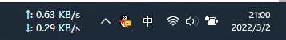
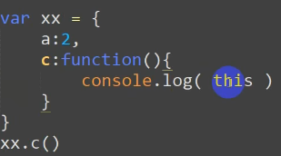
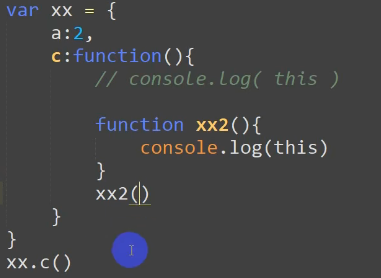
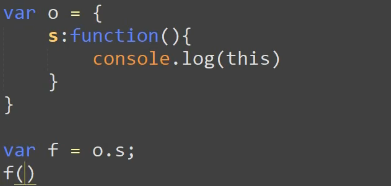
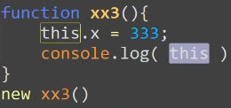
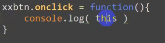

# 代码规范

**函数.类**

**后面不加分号**

```js
function fn (){}
```

# 作用域

**变量在某范围内的起作用和效果**

**减少命名冲突**

### **全局作用域**

script标签内或者，单独的js文件中

全局变量，在全局都能使用

比较占内存

```js
var num=1
```

### 局部作用域（函数作用域）

只能在函数内部使用

函数的形参也可以看做局部变量

执行就销毁，节约内存

```js
function(arg){
    //局部作用域
    var num=20；
    //这种也是全局变量
    num2=30；
}
```

块级作用域


### 作用域链

内部函数可以访问外部函数

由内到外一层一层

就近原则

# 插件

### 格式化插件

Beautify

### 括号颜色

Bracket Pair Colorizer

> 关键字保留字？

### 路径问题

html中../”来表示上一级目录

js中

./当前目录

.//上级目录-后退一级

### 合法标识符：

属性名由数字、字母、下划线以及$构成，并且数字还不能打头的时候可以使用点语法

# 国内gitup使用

站长ip：

20.205.243.166 github.com

162.125.32.13 github.global.ssl.fastly.net

复制ip到网站前面

c\windos\system32\drivers\etc\host

用写字板打开



### vscode自动换行

alt+z

## flex布局是否转块了？

flex布局设置的元素（父元素）被转换为块级元素或行内块

# this指向问题

函数内部的this,是在函数调用的时候来确定其指向的

### 函数直接调用是windos

```js
function xx( ){
console.log( this  )；
}
xx()
```

### 对象调用函数，this指向对象



### xx2不是对象的属性，还是windos调用的函数



f赋值时将引用传递到了o.s，所有调用的是windos的f函数



new的指向新对象



dom节点调用，this指向dom



css使用link引入

script使用src引入
