# 旋转变形

将transform属性的值设置为rotate(),即可实现旋转变形

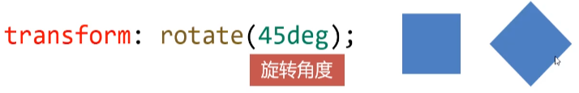

若角度为正，则顺时针方向旋转，否则逆时针方向旋转

### transform-origin属性

可以使用transform-origin属性设置自己的自定义变换原
点

transform-origin: 0 0;

### 缩放变形

将transform属性的值设置为scale()，即可实现缩放变形

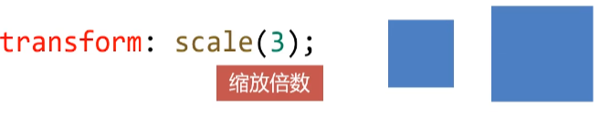

当数值小于1时，表示缩小元素;大于1表示放大元素

### 斜切变形

将transform属性的值设置为skew()，即可实现斜切变形

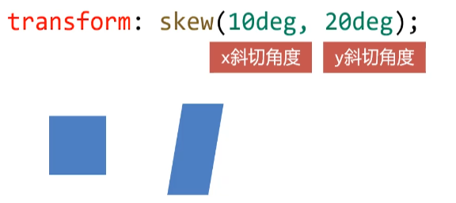

### 位移变形ie9

将transform属性的值设置为translate()，即可实现位移
变形

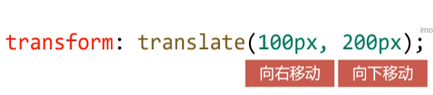

和相对定位非常像，位移变形也会“老家留坑”,“形影分离”

# 2-11.3d旋转

将transform属性的值设置为rotateX( )或者rotateY(),
即可实现绕横轴、纵轴旋转

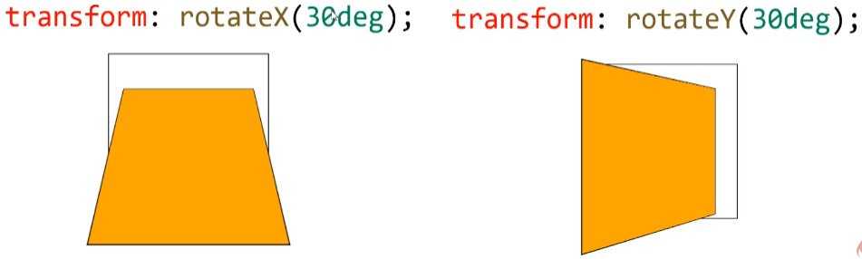

y轴正数是右肩膀向里旋转

### perspective属性

perspective属性用来定义透视强度，可以理解为"人眼到
舞台的距离”，单位是px

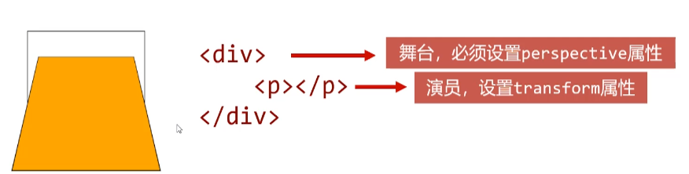

### 空间移动

当元素进行3D旋转后，即可继续添加translateX()、
translateY()、translateZ( )属性让元素在空间进行移动

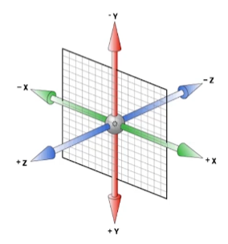

# 过渡

transition过渡属性是CSS3浓墨重彩的特性，过渡可以为

一个元素在不同样式之间变化自动添加“补间动画”

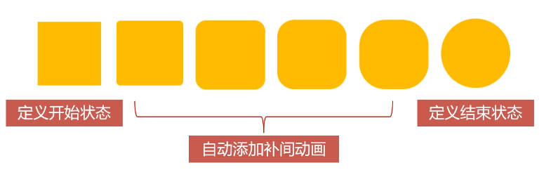

### 兼容性

过渡从**IE10**开始兼容，移动端兼容良好
曾几何时，网页.上的动画特效基本都是由JavaScript定时
器实现的，现在逐步改为使用CSS3过渡

优点:动画更细腻，内存开销小

### transition属性有4个要素

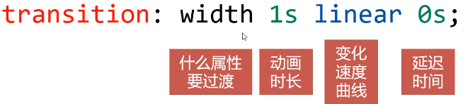

所有**数值类型**的属性，都可以参与过渡，比如width、
height、left、 top、 border- radius

背景颜色和文字颜色都可以被过渡
所有变形(包括2D和3D)都能被过渡

### all

如果要所有属性都参与过渡，可以写all

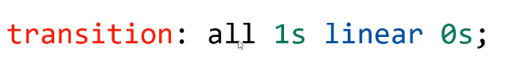

### 过渡的四个小属性

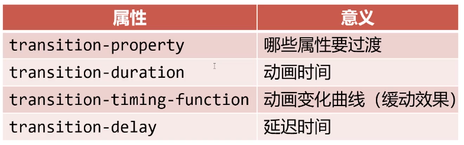

### 缓动参数

transition的第三个参数就是缓动参数，也是变化速度曲
线

#### 常用缓动参数

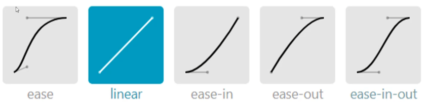

曲线陡表示变化的块

### 贝塞尔曲线

网站https://cubic-bezier.com/可以生成贝塞尔曲线,可以自定义动画缓动参数

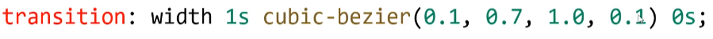

# 动画

> 可以使用@keyframes来定义动画，keyframes表示 "关键帧"在项目.上线前，要补上@-webkit-这样的私有前缀

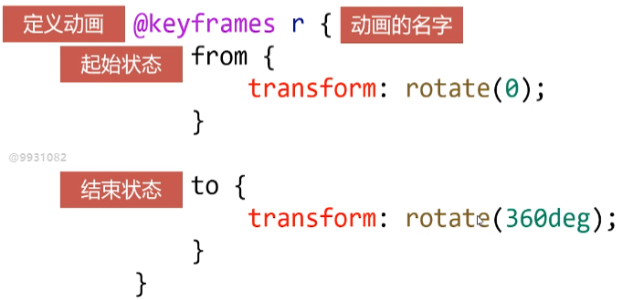

### 动画的调用

定义动画之后，就可以使用animation属性调用动画

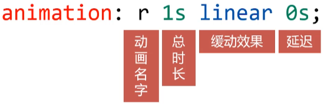

### 动画的执行次数

> 第五个参数就是动画的执行次数

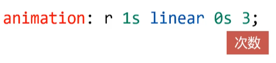

> 如果想永远执行可以写infinite

### alternate和forwards

如果想让动画的第2、4、.... (偶数次)自动逆向执行，那
么要加上alternate参数即可

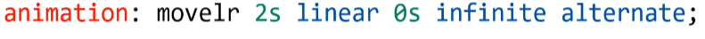

如果想让动画停止在最后结束状态，那么要加上forwards

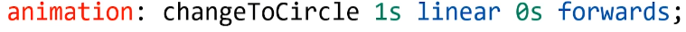

### 多关键帧动画

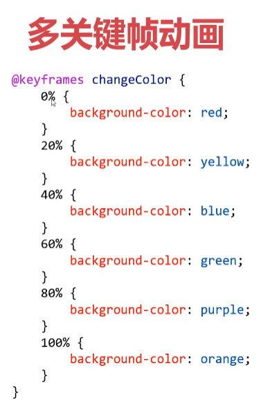

