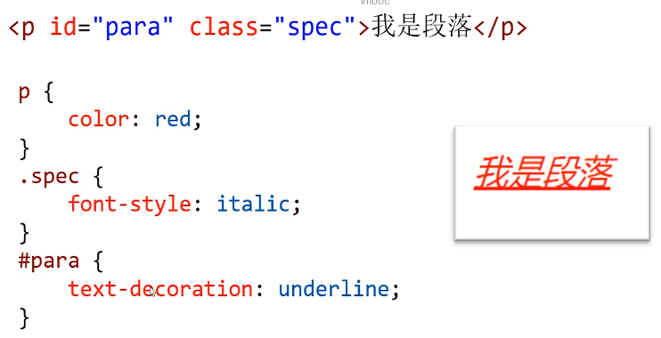
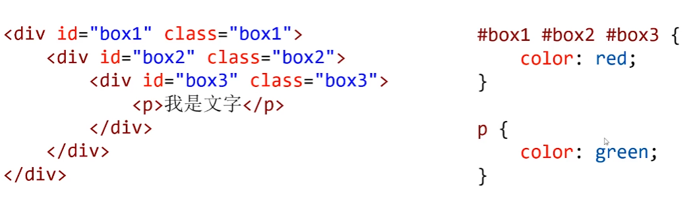

# css简介

CSS (cascading style sheet, **层叠式样式表**)是用来给HTML标签添加**样式**的语言

CSS3是CSS的最新版本，增加了大量的样式、动画、3D特效和移动端特性等

### 前端三层


CSS使样式和结构分离，样式和结构不用“杂糅着写”，而是彼此分开: HTML就负责**结构**，CSS负责**样式**


## 书写位置

### 内嵌式

在学习CSS时，最常使用内嵌式，顾名思义，内嵌在.html文件中在< head> < /head>标签对中，书写< style> < /style>标签
对，里面书写CSS语句

```css

<head>
    <meta charset="UTF-8">
    <meta name="viewport" content="width=device-width, initial-scale=1.0">
    <title>Document</title>
    <style>
        h1 {
            color: red;
        }
    </style>
</head>
<body>
    <h1>我是一个主标题</h1>
    <h1>我是一个主标题</h1>
    <h1>我是一个主标题</h1>
</body>
</html>
```

### 外链式

可以将CSS单独存为.css文件，然后使用**< link>标签**引入它


```css
<head>
    <meta charset="UTF-8">
    <meta name="viewport" content="width=device-width, initial-scale=1.0">
    <title>Document</title>
    <link rel="stylesheet" href="css/css.css">
</head>
<body>
    <h1>主标题</h1>
    <h1>主标题</h1>
    <h1>主标题</h1>
</body>
</html>
```

### 导入式(不用)

使用导入式引入的样式表，不会等待css文件加载完毕，而是会**立即渲染**HTML结构，所以页面会有几秒中的素面朝天的时间

```css
<head>
    <meta charset="UTF-8">
    <meta name="viewport" content="width=device-width, initial-scale=1.0">
    <title>Document</title>
    <style>
        @import url(css/css.css);
    </style>
</head>
<body>
    <h1>主标题</h1>
    <h1>主标题</h1>
    <h1>主标题</h1>
    <h1>主标题</h1>
</body>
```

### 行内式

样式可以直接通过style属性**写在标签身上**

行内式牺牲了样式表的批量设置样式的能力，只能给一个标
签设置样式，所以不常用

```css
<html lang="en">
<head>
    <meta charset="UTF-8">
    <meta name="viewport" content="width=device-width, initial-scale=1.0">
    <title>Document</title>
</head>
<body>
    <h1 style="color: red;">我是一个主标题</h1>
    <h1 style="color: red;">我是一个主标题</h1>
    <h1 style="color: red;">我是一个主标题</h1>
</body>
```

### 去掉列表样式

```css
 ul {
            list-style: none;
        }
```

### 去掉超级链接下滑线

```css
text-decoration: none
```

### id#

id的名称只能由**字母、数字、下划线、 短横**构成，且不能以
数字开头，字母区分大小写,但习惯上一般为小写字母

同一个页面上不能有相同id的标签

CSS选择器可以使用井号**#前缀**,选择指定id的标签

```css
#para1 {
            color: red;
        }
```

### class选择器.

class属性表示"类名'

```css
< p class="warning" >我是段落< /p>
```

类名的命名规范和id的命名规范相同


使用点.前缀选择指定class的标签

```css
.warning {
	color: red;
}
```

多个标签可以为相同类名

同一个标签可以同时属于多个类，类名用**空格**隔开

### 文字倾斜

```css
font-style:italic;
```

### 原子类

在做网页项目前，可以将所有的常用字号、文字颜色、行高
外边距、内边距等都设置为单独的类


### 复合选择器


### 后代选择器

CSS选择器中，使用**空格**表示“后代”，后代可以**隔代**，并且选中全部后代


### 交集选择器

中间没有空隙

### 并集选择器

并集选择器也叫作分组选择器，**逗号**表示分组

# 伪类

伪类是添加到选择器的描述性词语,指定要**选择的元素的特殊状态**，超级链接拥有4个特殊状态

这种类名是一种特殊状态，所有叫伪类


### 爱恨准则

a标签的伪类书写，要按照“ 爱恨准则”的顺序，否则会有伪类不生效


### 元素关系选择器


### 子选择器ie7

当使用**>**符号分隔两个元素时，它只会匹配那些作为第一个元素的直接后代元素，即两个标签为**父子关系**


后代选择器不一定限制是子元素

### 相邻兄弟选择器ie7

相邻兄弟选择器(+)介于两个选择器之间，当第二个元素**紧**
**跟在第一个元素之后**，并且两个元素都是属于**同一个父元素**
的子元素，则第二个元素将被选中
说白了，a+ b就是选择“紧跟在a后面的一个b'

### 通用兄弟选择器ie7

通用兄弟选择器(~) ，a~b选择a元素**之后**所有**同层级b元素**


span默认是一行

### 序号选择器


### :first-child

:first-child表示"选择第一个子元素” ，比如下面的例子就
表示选择. box1盒子中第一个p

### :last-child

表示"选择最后一个子元素”

比如下面的例子
就表示选择.box1盒子中最后一个p


### :nth-child()

可以选择任意序号的子元素


2n+ 1等价于odd,表示奇数


2n等价于even，表示偶数


### :nth-of-type()

:nth-of-type()将选择同种标签指定序号的子元素


### :nth-last-child()和:nth-last-of-type()


### 属性选择器


### CSS3新增伪类


:empty表示选中标签内部为空的标签，内部有空格不会被选中


# ::before和::after

类似于

a::before{

content：'方块'


### ::selection选中文字改变样式

```css
. box1: :selection {
/*背景颜色*/
background-color: 0 springgreen;
color: [ ] deeppink ;
}
```

### ::first-letter和::first-line

第一个文字，第一行

```css
. box::first-letter {
font-size: 50px;
}
. box1: :first-line {
/* 添加下划线*/
text-decoration: underline ;

```


# 层叠性

CSS全名叫做“层叠式样式表”，层叠性是它很重要的性质

层叠性:**多个选择器可以同时作用于同一个标签**，效果叠加



多个选择器定义的属性有冲突

### 选择器权重

id权重>class权重>标签权重

复杂选择器可以通过(id的个数，class的个数,标签的个数)的形式，计算权重


### !important提升权重

如果我们需要将某个选择器的某条属性提升权重，可以在属
性后面写!important


很多公司不允许使用! important,因为这会带来不经意的样式冲突

# 文本和文字属性

### color属性

color属性可设置文本内容的**前景色**
color属性主要可以用英语单词、十六进制、rgb()、 rgba()
等表示法
英语单词表示法，比如color: red; 仅仅用于学习时临时设置一下颜色，工作时基本不用这样的形式，因为追求精确

### color属性-十六进制表示法

十六进制表示法是所有设计软件中都通用的颜色表示法，设
计师给我们的设计图.上面标注的颜色，通常为十六进制表示
color: #ff0000;红绿蓝

比如十六进制ff就是十进制的255，每种颜色分量都是0~255
的数字

如果颜色值是#aabbcc的形式，可以简写为#abc

黑色是#000，白色是#fff，常见的灰色有#ccc、#333、
#2f2f2f等

### rgb()表示法

颜色也可以用rgb( )表示法
color: rgb(255, 0, 0);

### rgba()表示法

颜色也可以用rgba()表示法，最后一个参数表示透明度,介于0到1之间，0表示纯透明，1表示纯实心
color: rgba(255, 0, 0,.65);

### font-size属性

font-size属性用来设置字号，单位通常为px。今后课程上老师还会介绍em、rem单位。
font-size: 30px;

网页文字正文字号通常是16px,浏览器最小支持10px字号

font-weight

font-weight属性设置字体的粗细程度,通常就用normal和
bold两个值


### font-style属性

font-sty1e属性设置字体的倾斜


### text-decoration属性

text-decoration属性用于设置文本的**修饰线**外观的(下划
线、删除线)


### font-family属性

电脑默认是微软雅黑

font- family属性用于设置字体
font-family: "微软雅黑";
字体可以是列表形式，**一般英语字体放到前面**，后面的字体
是前面的字体的“**后备**”字体

英文字体放在前面，因为中文字体自带有英文的字体

```css
font-family: serif, "Times New Roman"，"微软雅黑";
```

### 中文字体

也可以称呼它们的英语名字中文字体名
等价的英语字体名
font -family: "微软雅黑 "
font-family: "Microsoft Yahei"
font-family: "宋体"
font-family: "SimSun"

字体通常必须是用户计算机中已经安装好的字体，所以一般
来说设置为微软雅黑和宋体较多,设置成其他字体较少

如何设置为用户电脑中没有的字体呢?那就必须自己定义新
字体，这就需要我们有字体文件，用户加载网页的时候，会
同时下载这些字体文件

### 定义字体

字体文件根据操作系统和浏览器不同，有eot、woff2、woff、ttf、 svg文件格式，需要同时有这5种文件


阿里巴巴普惠体
阿里巴巴提供了一套免费商用授权的普惠字体，网址
https://wWW.iconfont.cn/webfont
使用阿里巴巴普惠字体也省去了下载字体的麻烦


### 自己定义字体

iconfont.cn


阿里巴巴普惠体


复制到css最前面


必须使用已经输入框内的文字

### 本地方法

```css
@font-face {
            font-family: 'webfont';
            font-display: swap;
            src: url('fonts/webfont.eot');
            /* IE9*/
            src: url('fonts/webfont.eot') format('embedded-opentype'),
                /* IE6-IE8 */
                url('fonts/webfont.woff2') format('woff2'),
                url('fonts/webfont.woff') format('woff'),
                /* chrome、firefox */
                url('fonts/webfont.ttf') format('truetype'),
                /* chrome、firefox、opera、Safari, Android, iOS 4.2+*/
                url('fonts/webfont.svg') format('svg');
            /* iOS 4.1- */
        }
```

# 段落和行

### text-indent属性

text- indent属性定义首行文本内容之前的缩进量,缩进两个
字符应该写作


### line-height

line -height属性用于定义行高，我们先来认识什么是行高


line - heigh属性的单位可以是以px为单位的数值

line- heigh属性也可以是没有单位的数值，表示**字号的倍数**
，这是最推荐的写法

```css
line-height: 1.5;
```

### 文本垂直居中

设置行高=盒子高度，即可实现单行文本垂直居中

### 水平居中

设置text-align: center, 即可实现文本水平居中.

### font合写属性


### 继承性

文本相关的属性普遍具有继承性，只需要给**祖先标签**设置,
即可在后代所有标签中生效
●color
●font-开头的
list-开头的
text-开头的
●line-开头的

因为文字相关属性有继承性，所以通常会设置body标签的
字号、颜色、行高等，这样就能当做整个网页的默认样式了


### 就近原则



绿色

## 就近原则大于权重

# 盒模型

所有HTML标签都可以看成矩形子,由width、 height、
padding、border构成， 称为“ 盒模型"


盒子的总宽度= width +左右padding +左右border 

盒子的总高度= height +上下padding +上下border

### width属性

当块级元素(div、 h系列、li等) 没有设置width属性时，它.
将**自动撑满**整个屏幕，但这并不意味着width可以继承


### height属性

盒子的height属性如果不设置， 它将**自动被其内容**撑开，如
果没有内容，则height默认是0

### padding

快捷键pdt上边距

padding是盒子的内边距，即盒子边框内壁到文字的距离

padding-top  上padding
padding-right  右padding
padding- bottom  下padding
padding-left  左padding


### margin

margin-top  上margin, "向 上踹”
margin-right  右margin, "向右踹”
margin- bottom  下margin, "向下踹”
margin-left  左margin,"向左踹"

### 塌陷现象

**竖直方向**的margin有塌陷现象:小的margin会塌陷到大的
margin中，从而margin不叠加，只**以大值**为准

一些元素(比如body、ul、 p等)都有默认的margin,在开
始制作网页的时候，要将他们清除

### 盒子的水平居中

将盒子左右两边的margin都设置为auto,盒子将水平居中

```css
box {
margin:0 auto;
}
```

### 盒模型


### box- sizing属性ie9

将盒子添加了box-sizing: border-box;之后，盒子的width
height数字就表示盒子实际占有的宽高(不含margin)
了，即padding、 border变为 "内缩”的,不再“外扩"


box-sizing属性大量应用于移动网页制作中，因为它结合百
分比布局、弹性布局等非常好用，在PC页面开发中使用较少

### 行内元素和块级元素


### 行内元素

不能设置宽高，并排显示

### 行内块

img和表单元素是特殊的行内块，它们**既能够设置宽度高度**
也能够**并排**显示

### 行内元素和块级元素的相互转换

使用display:block ;即可将元素转为**块级元素**
使用display: inline ;即可将元素转为行内元素，将元素转
为**行内元素**的应用不多见
使用display: inline- block;即可将元素转为**行内块**

### 元素的隐藏

使用display: none;可以将元素隐藏，元素将彻底**放弃位**
**置**，如同没有写它的标签一样

使用visibility: hidden; 可以也可以将元素隐藏，但是
元素**不放弃自己的位置**
