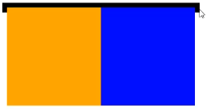

# 浮动

浮动的最本质功能:用来实现并排

### 浮动使用要点

要浮动，并排的盒子都要设置浮动
父盒子要有**足够的宽度**，否则子盒子会掉下去

### 浮动的顺序贴靠特性

子盒子会按顺序进行贴靠，如果没有足够空间，则会寻找再
前一个兄弟元素

### 浮动的元素一定能设置宽高

浮动的元素**不再区分块级元素、行内元素**，已经脱离了标准
文档流，一律能够设置宽度和高度，即使它是span或者a标
签等

### 右浮动

float:right ;即可设置右浮动

## 使用浮动实现网页布局

垂直显示的盒子，不要设置浮动，只有并排显示的盒子才要
设置浮动!

“大盒子带着小盒子跑”，-个大盒子中，又是一一个小天地
内部可以继续使用浮动的
超市售卖的塑料袋0.3元一个，div是免费的!不要节约盒子!

## BFC规范和浏览器差异

BFC (Box Formatting Context,块级格式化上下文)是页
面.上的一个隔离的独立容器，容器里面的子元素不会影响到
外面的元素，反之亦然

一个盒子不设置height, 当内容子元素都浮动时，无法撑起自身
这个盒子没有形成BFC

方法①: float的值不是none
方法②: position的值不是static或者relative
方法③: display的值 是inline-block. flex或者inline-flex
方法④: overflow:hidden;

什么是overflow:hidden;

### overflow:hidden

表示溢出隐藏，**溢出盒子边框的内容将会被隐藏**

padding部分没被隐藏

overflow:hidden;是非常好用的让盒子形成BFC的方法

### BFC的其他作用

BFC可以取消盒子margin塌陷
BFC可以可以**阻止元素被浮动元素覆盖**

浏览器差异
IE6、7浏览器使用haslayout机制，和BFC规范略有差异,
比如IE浏览器可以使用zoom:1属性"让盒子拥有layout"

如果要制作兼容到IE6、7的网页时，尽量让网页布局变得简
单，内部有浮动的盒子要设置height属性,规范编程,不要
"玩杂技”

## 清除浮动

