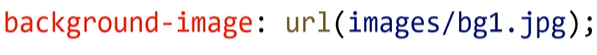

# 浮动

浮动的最本质功能:用来实现并排

### 浮动使用要点

要浮动，并排的盒子都要设置浮动
父盒子要有**足够的宽度**，否则子盒子会掉下去

### 浮动的顺序贴靠特性

子盒子会按顺序进行贴靠，如果没有足够空间，则会寻找再
前一个兄弟元素


### 浮动的元素一定能设置宽高

浮动的元素**不再区分块级元素、行内元素**，已经脱离了标准
文档流，一律能够设置宽度和高度，即使它是span或者a标
签等

### 右浮动

float:right ;即可设置右浮动


## 使用浮动实现网页布局

垂直显示的盒子，不要设置浮动，只有并排显示的盒子才要
设置浮动!

“大盒子带着小盒子跑”，-个大盒子中，又是一一个小天地
内部可以继续使用浮动的
超市售卖的塑料袋0.3元一个，div是免费的!不要节约盒子!

## BFC规范和浏览器差异

BFC (Box Formatting Context,块级格式化上下文)是页
面.上的一个隔离的独立容器，容器里面的子元素不会影响到
外面的元素，反之亦然

一个盒子不设置height, 当内容子元素都浮动时，无法撑起自身
这个盒子没有形成BFC


方法①: float的值不是none
方法②: position的值不是static或者relative
方法③: display的值 是inline-block. flex或者inline-flex
方法④: overflow:hidden;

什么是overflow:hidden;

### overflow:hidden

表示溢出隐藏，**溢出盒子边框的内容将会被隐藏**

padding部分没被隐藏

overflow:hidden;是非常好用的让盒子形成BFC的方法

### BFC的其他作用

BFC可以取消盒子margin塌陷
BFC可以可以**阻止元素被浮动元素覆盖**

浏览器差异
IE6、7浏览器使用haslayout机制，和BFC规范略有差异,
比如IE浏览器可以使用zoom:1属性"让盒子拥有layout"

如果要制作兼容到IE6、7的网页时，尽量让网页布局变得简
单，内部有浮动的盒子要设置height属性,规范编程,不要
"玩杂技”

## 清除浮动

清除浮动:浮动一定要封闭到一个盒子中，否则就会对页面后续元素产生影响

### 清除浮动方法1

让内部有浮动的父盒子形成BFC,它就能关闭住内部的浮动。此时最好的方法就是overflow:hidden属性


### 清除浮动方法2

给后面的父盒子设置clear:both属性。
clear表示清除浮动对自己的影响，both表示左右浮动都清除

因为前面和盒子没有高度，所以margin失效


### 清除浮动方法3

使用::after伪元素给盒子添加最后一个子元素，并且给:after设置clear:both。


```css
 * {
            margin: 0;
            padding: 0;
        }

        .clearfix::after {
            content: '';
            clear: both;
            /* 转为块级元素 */
            display: block;
        }

        div {
            margin-bottom: 10px;
        }

        p {
            float: left;
            width: 100px;
            height: 100px;
            background-color: orange;
            margin-right: 20px;
        }
```

```html
<div class="clearfix">
        <p></p>
        <p></p>
    </div>
    <div class="clearfix">
        <p></p>
        <p></p>
    </div>
```


### 清除浮动方法4

在两个父盒子之间“隔墙”隔一个携带clear:both的盒子


使用高度来隔开

# 定位

### 相对定位

相对定位:盒子可以**相对自己原来的位置**进行位置调整,称为相对定位


### 位置描述词

left向右移动; right向左移动; top向下移动; bottom向上移
动

相对定位的元素，会在“老家留坑”，本质上仍然是在原来
的位置，只不过渲染在新的地方而已，渲染的图形可以比喻成“影子”,
不会对页面其他元素产生任何影响

#### 相对定位的用途

相对定位用来**微调元素位置**
相对定位的元素，可以当做绝对定位的参考盒子

## 绝对定位

绝对定位:盒子可以在浏览器中以坐标进行位置精准描述,
拥有自己的绝对位置


### 位置描述词

left到左边的距离; right到右边的距离; top到.上边的距离
bottom到下边的距离

### 绝对定位脱离标准文档流（比原来位置高）

绝对定位的元素脱离标准文档流，将释放自己的位置，对其
他元素不会产生任何干扰，而是对它们进行压盖

相对定位是老家留坑

**脱离标准文档流的方法:浮动、绝对定位、固定定位**

### 绝对定位的参考盒子

绝对定位的盒子并不是永远以浏览器作为基准点
绝对定位的盒子会以自己祖先元素中，离自己最近的拥有定
位属性的盒子，当做基准点。这个盒子通常是相对定位的,
所以这个性质也叫作“子绝父相”

### 绝对定位的盒子垂直居中

绝对定位的盒子垂直居中是一一个非常实用的技术

position: absolute;
top: 50%
margin-top: -自己高度一半;

### 堆叠顺序z-index属性

z-index属性是一个没有单位的正整数,数值大的能够压住
数值小的

### 绝对定位的用途

绝对定位用来制作"压盖”、"遮罩”效果
绝对定位用来结合CSS精灵使用
绝对定位可以结合JS实现动画


## 固定定位

固定定位:不管页面如何卷动，它永远固定在那里

固定定位只能以页面为参考点，没有子固父相这个性质

固定定位脱离标准文档流

```css
.box {
            position: fixed;
            bottom: 100px;
            right: 100px;
            width: 100px;
            height: 100px;
            background-color: orange;
        }
```

# border属性

border属性需要三个要素


### 线型


### 四个方向的边框


### 去掉边框

border-left: none ;属性即可去掉左边框，以此类推

### 制作三角形

```css
box1 {
            width: 0;
            height: 0;
            /* transparent是透明色 */
            border: 20px solid transparent;
            border-top-color: red;
        }
```

### border-radius属性

border- radius属性的值通常为px单位，表示圆角的半径
border-radius: 10px;


border- radius属性可以单独设置四个圆角


也可以使用小属性


百分比为单位

border- radius属性的值也可以用百分比做单位，表示圆角
起始于每条边的哪里

### 正圆形

正方形盒子如果设置的border- radius属性为50%，就是正
圆形

长方形盒子如果设置的border- radius属性为50%，就是椭
圆形

# 阴影

### box-shadow属性


### 阴影延展


### 内阴影

box- shadow属性值前加inset单词，表示内阴影


### 多阴影

box- shadow属性值可以用逗号隔开多个，表示携带多个阴影

阴影颜色叠加

```css
 box-shadow: 2px 2px 30px red, 4px 4px 40px blue, 6px 6px 50px green, inset 0px 0px 6px orange;
```


# 背景颜色

### background-color属性

background-color属性表示背景颜色
背景颜色可以用十六进制、rgb()、 rgba()表示法表示

**padding区域**是有背景颜色的

### background-image属性

background-image属性用来设置背景图片，图片路径要写
到url()圆括号中，可以是相对路径，也可以是http://开头的
绝对路径



如果样式表是外链的，那么要书写从**CSS**出发到图片的路径
，而不是从html出发

### 背景图片的重复模式

background-repeat属性用来设置背景的重复模式


### background-size属性

background-size属性用来设置**背景图片**的尺寸，兼容到IE9


值也可以用百分数来设置，表示为盒子宽、高的百分之多少
需要等比例设置的值，写auto

contain和cover
contain和cover是两个特殊的background-size的值

**contain**表示将背景图片智能改变尺寸以**容纳**到盒子里（完整显示）


**cover**表示将背景图片智能改变尺寸以**撑满**盒子（不留白）


## 背景裁切

background-clip属性
background-clip属性用来设置元素的背景裁切到哪个盒子
兼容到IE9。


borderbox，边框也是有背景的

### 背景起源

background-origin: content- box;

设置到和背景裁切background—clip一致就刚好同源

### 背景固定

background-attachment属性

background-attachment属性决定背景图像的位置是在视
口内固定，或者随着包含它的区块滚动。


### 添加滚动条

溢出内容用纵向滚动条显示

overflow-y：scroll

### 背景图片位置

#### background-position属性

background-position属性可以设置背景图片出现在盒子的
什么位置


可以用top、bottom、center、 left、 right描述图片 出现的
位置

相对于盒子的位置

### css精灵

CSS精灵:将多个小图标合并制作到一张图片上，使用
background-position属性单独显示其中一个，这样的技术
叫做CSS精灵技术，也叫作CSS雪碧图

CSS精灵可以减少HTTP请求数，加快网页显示速度。缺点也
很明显:不方便测量、后期改动麻烦

切片工具-框住-双击-xy的值加负号

### background综合属性

一些常用的背景相关小属性，可以合写到一条background
属性中


# 渐变

### 线性渐变

盒子的background- image属性可以用linear- gradient()
形式创建线性渐变背景


#### 渐变方向也可以写成度数表示右上到左下


可以有多个颜色值，并且可以用百分数定义它们出现的位置


## 浏览器私有前缀

不同浏览器有不同的私有前缀，用来对试验性质的CSS属性加以标识.


```css
.box1 {
            width: 200px;
            height: 200px;
            border: 1px solid #000;
            margin-bottom: 10px;
            background-image: -webkit-linear-gradient(to right, red, blue);
            background-image: -moz-linear-gradient(to right, red, blue);
            background-image: -ms-linear-gradient(to right, red, blue);
            background-image: -o-linear-gradient(to right, red, blue);
            background-image: linear-gradient(to right, red, blue);
        }
```

### 径向渐变

盒子的background- image属性可以用radial-gradient( ) .
形式创建径向渐变背景


