# 认识HTML5骨架

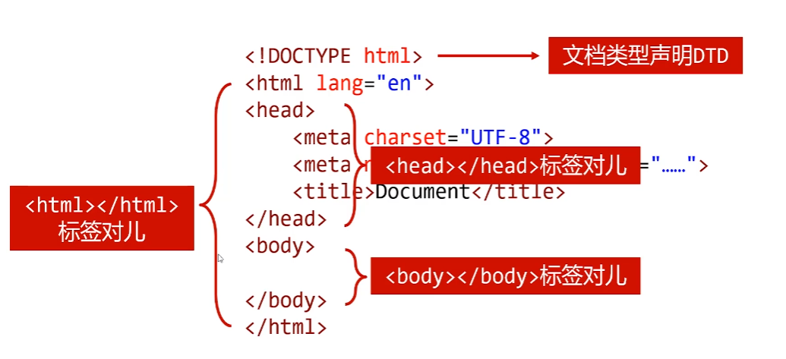

### 文档类型声明DTD

HTML文件第一行必须是DTD (Document Type Definition
文档类型声明)
不写DTD会引|发浏览器的一-些兼容问题

```html
HTML5:
< !DOCTYPE html>
```

不同版本的HTML有不同的DTD写法

不同版本的HTML的DTD

```html
//HTML4.01严格版:
<!DOCTYPE HTML PUBLIC "-
//W3C//DTD HTML 4.01/ /EN" "http://www. w3. org/TR/
html4/strict. dtd">

//HTML4.01过渡版:
< !DOCTYPE HTML PUBLIC"_//W3C//DTD HTML 4.01 Transitional/ /EN" "http://Www. w3. org/TR/ htm14/ loose.dtd">

//HTML4.01框架版:
<!DOCTYPE HTML PUBLIC "-
/ /W3C//DTD HTML 4.01 Frameset//EN" "http: //www. W3
. org/TR/html4/frameset.dtd">
```

### W3C组织

W3C (The World Wide Web Consortium, 万维网联合会
)是万维网的主要国际标准组织。该联盟成立于1994年，负
责制定Web标准，主要是HTML和CSS。

### 认识<html>标签对儿


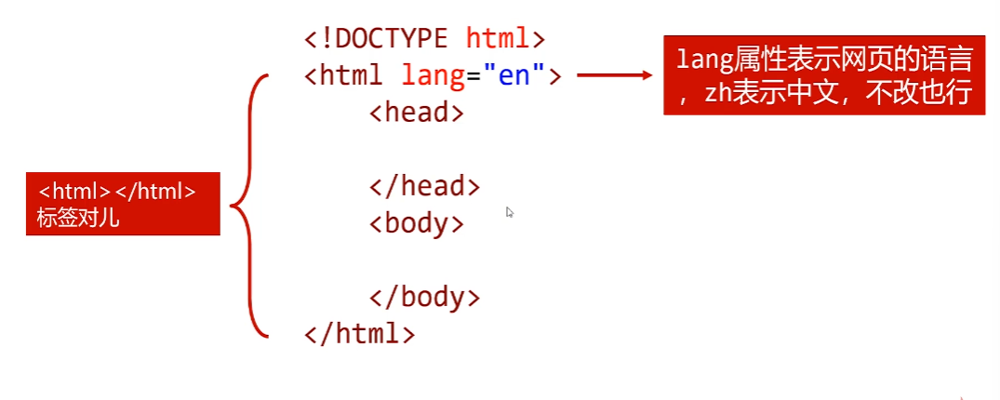

### 认识<head>和<body>标签对儿

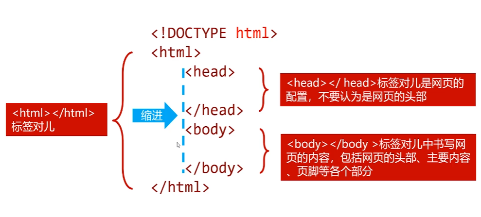

### 字符集

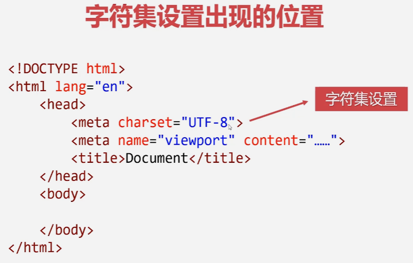


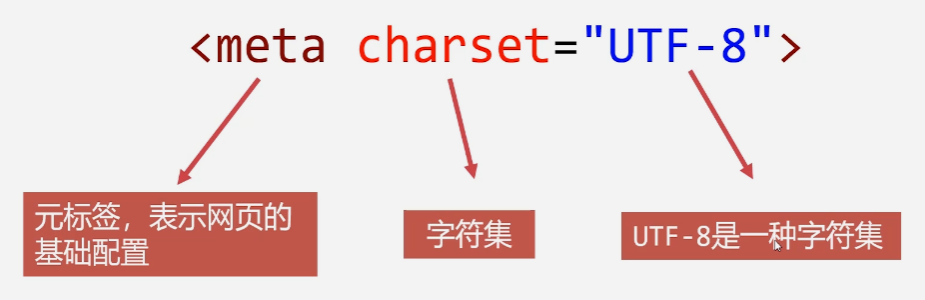

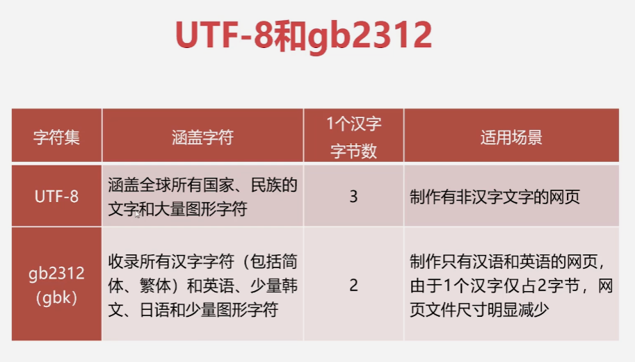

gb2312可以在一定程度上节约内存

#### 更改网页的字符集

无论使用哪种字符集，-定要在VScode编辑器中将文件也设
置为相同字符集，否则会出现乱码，然后更改meta标签:


Live Server插件不支持gb2312 (gbk) 字符集，只支持
UTF-8字符集，只能双击图标打开


先改字符集代码

```html
<meta charset="gb2312">
```

再改底部的utf-8

通过编码保存

搜索gb2312

# title

网页的标题

title标签用来设置网页的标题，文字会显示在浏览器的标签栏上

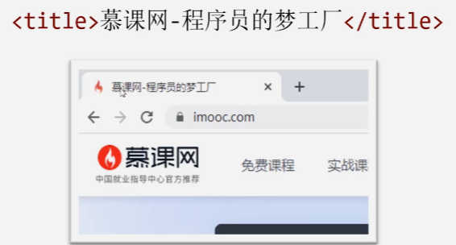

title也是搜索引|擎收录网站时显示的标题，为了**吸引用户点击**，合理设置title是必要的

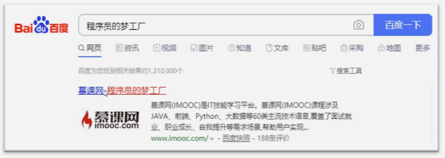

#### 网页关键词和页面描述

合理设置网页的网页的关键词和页面描述，也是SEO的重要
手段
SEO (Search Engine Optimization, 搜索引擎优化)利
用搜索引擎的规则提高网站在有关搜索引|擎内的自然排名,
让网站在搜索引|擎的结果中内占据领先地位，获得品牌收益


使用meta标签设置网页关键词和描述，**name属性非常关键**，
用来设置meta的具体功能


##### 关键词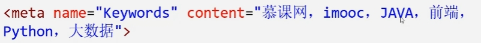


##### 页面描述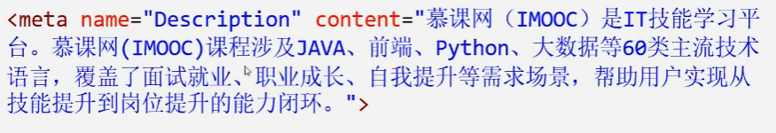

页面描述也是搜索引|擎显示的**简介**词语

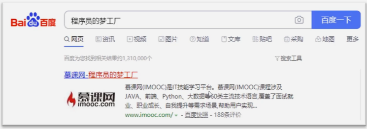

# 认识标签

标签通常**成对儿**出现

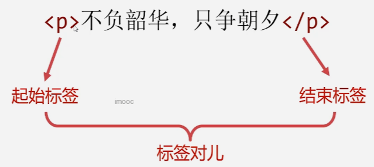

### 单标签

有的标签不是成对儿的，而是只有起始标签，称为单标签

<meta charset="UTF-8">
在HTML 4代，单标签必须写一个结尾的反斜杠，HTML 5不用写

## 标题标签

h系列标签表示"标题”语义，h是**headline**的意思

标签
语义
h1	一级标题
h2	二级标题
h3	三级标题
h4	四级标题
h5	五级标题
h6	六级标题

**搜索引擎非常看重<h1></h1>标签的内容**，应该将重点内容
放到<h1></h1>中，比如网页的1ogo等

h1标签一般**只能放置一个**， 否则会被搜索引擎视为作弊


### 段落标签

<p></p>标签表示段落标签，p是英语paragraph的意思
任何段落都要放到<p></p>标签中，因为HTML中即使代码换
行了，页面显示效果也不会换行，必须写到<p></p>中!

而且<p></p>标签中**不能嵌套h系列标签和其他p标签**

# div标签

div是英语division "分割”的缩写，顾名思义，<div></div>标签对用来将相关的内容组合到一起，以和其他内容分割，使文档结构更清晰
比如，网页的头部要放到一个<div></div>标签对中 ,轮播图也要放到一个<div></div>标签对中， 文章内容也要放到一个<div></div>标签对中


