# 无序列表

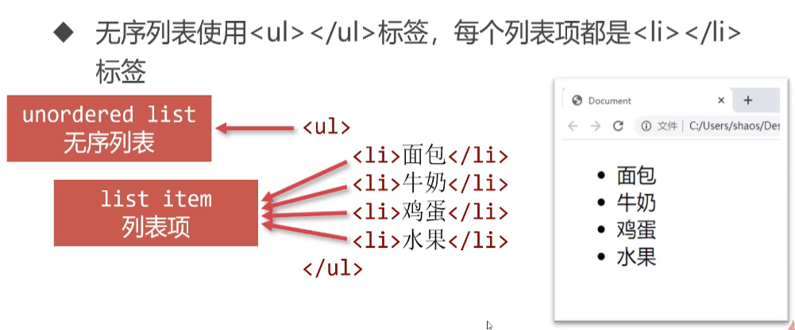


### 正确的缩进

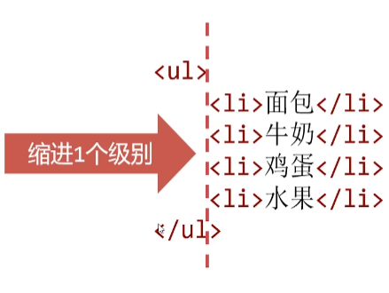

HTML规定，<ul> 的子标签只能是<li>,绝对不能出现其它任何标签

<li>中可以放任何标签
<li>标签是容器，内部可以放任何其他标签

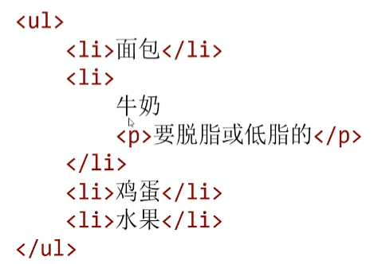

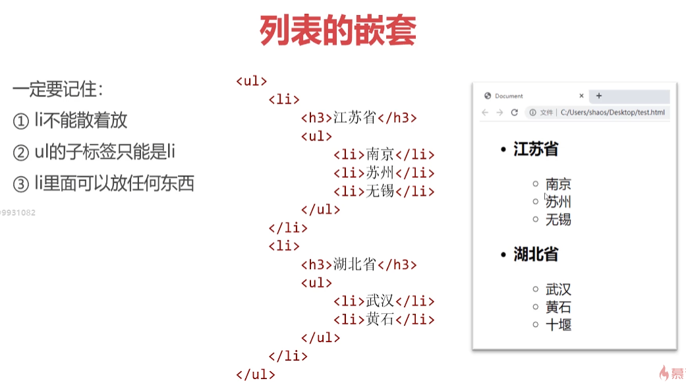


### 无序列表的type属性

无序列表有type属性，可以定义前导符号的样式，但是在
HTML5中已经被废弃,建议使用CSS替代

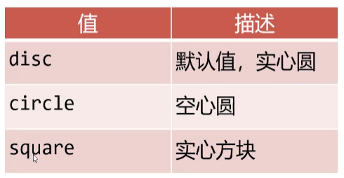

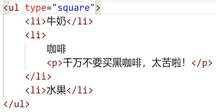


有序列表

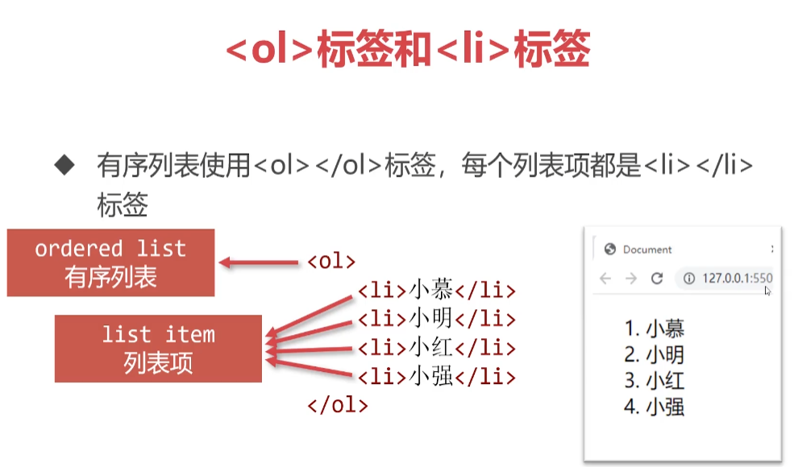

### <ol>标签的type属性

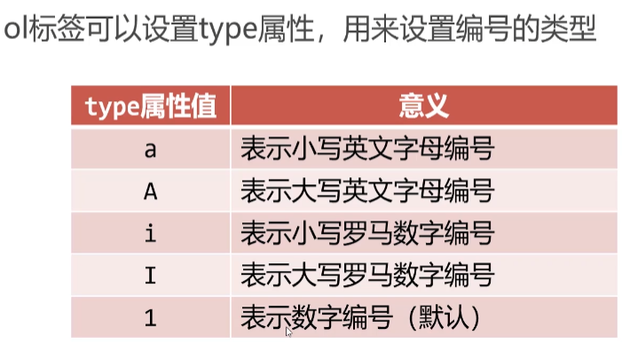

### < ol>标签的start属性

start属性值必须是一个整数,指定了列表编号的起始值
此属性的值应为阿拉伯数字，尽管列表条目的编号类型type
属性可能指定为了罗马数字编号等其他类型的编号

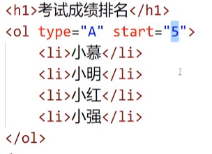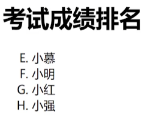

### < ol>标签的reversed属性

reversed属性指定列表中的条目**是否是倒序排列的**
I
reversed属性不需要值，只需要写reversed单词即可， 这是
HTML5的全新特性

```js
<ol reversed>
    <li></li>
</ol>
```

# 定义列表

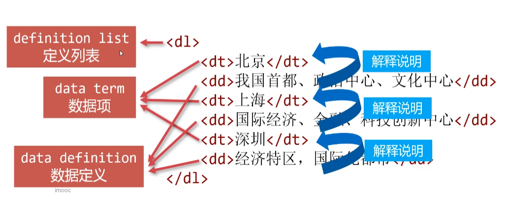

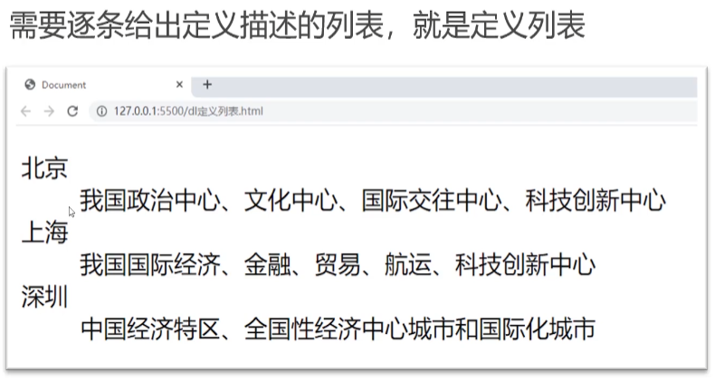

也允许dt和dd不交替出现，而是分别处于不同的定义列表中


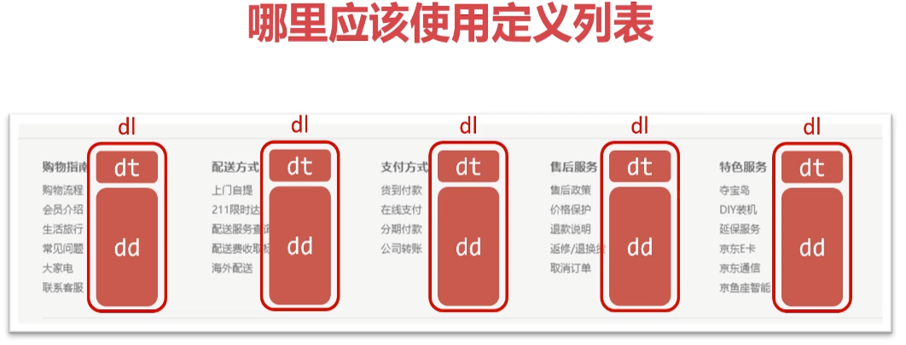

