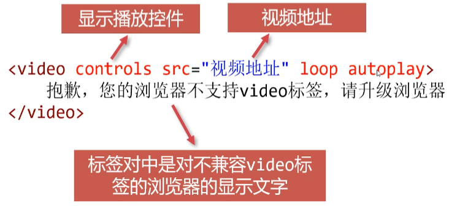

# 图片标签


图片本质上没有被插入到网页中，只是被**引入**到了网页中，
所以将来要将图片也一起上传到服务器.上，将图片复制到项
目文件中，即可整体上传

### alt属性


是alternate "替代品”的缩写，它是对图像的文本
**描述**，不是强制性的

如果由于某种原因无法加载图像，浏览器会在页面上显示alt
属性中的**备用文本**
供视力不方便的朋友使用的网页**朗读器**，也会朗读alt中的文本

### width、 height属性

width、height属性分别设置宽度和高度,单位是像素,但
是**不需要写单位**


如果省略其中一个属性，则表示**按原始比例缩放**图片

### 网页支持的格式

| 格式         | 说明                                                   |
| ------------ | ------------------------------------------------------ |
| bmp          | windows画图软件默认保存的格式，位图                    |
| gif          | 支持动画(比如表情包)                                   |
| .jpeg( .jpg) | 有损压缩图片，用于照片                                 |
| . png        | 便携式网络图像，用于logo、背景图形等，支持透明和半透明 |
| svg          | 矢量图片                                               |
| webp         | 最新的压缩算法非常优秀的图片格式                       |

### 相对路径

路径网址：https://class.imooc.com/lesson/2110#mid=49988

相对路径:描述从网页出发，如何找到图片。比如“前面路
口左转，直走100米后右转就到了"


随着网页和图片的位置关系不同，插入图片的代码随之改变
如果需要**回退层级**，使用"../" 这样的写法

同级路径'./'可以省略

根路径/

### 绝对路径

绝对路径:描述图片精准地址。比如“北京市海淀区西三环北路甲2号院中关村国防科技园2号楼"

< img src="https://WWw.imooc.com/static/img/index/logo-recommended.png">

window系统中，盘符使用的是反斜杠: C:\Users\Desktoplproject

为了统一书写方式， 建议路径中都使用正斜杠"/"。

# 超级链接

超级链接是将网页和网页连结到一起的方法，是互联网成网”的原因

a标签


### title


在**新窗口**中打开网页


### 给图片设置超级链接


### 页面内锚点

较长的页面，可以适当的给h系列标签添加id属性，它将成为页面的"锚点"


### 返回顶部


### 邮件链接、电话链接


# 音频和视频

曾几何时,在网页中插入音频和视频需要借助Flash,今天,Flash技术已经快要被淘汰，HTML5可以轻松在网页中插入音频和视频

### 音频audio

兼容到IE9


#### 常用音频格式

mp3和ogg格式

#### autoplay属性

声明autoplay属性，音频会**自动播放**
常用的浏览器为了不打扰用户，可能会**不允许**自动播放音乐，必须让用户手动点击之后才能播放

#### loop属性

声明loop属性，将**循环播放**音频

### 视频

在浏览器中插入视频需要使用<video>标签，兼容到IE9



#### 常用音频格式

mp4、ogv、webm等格

# 大纲标签

### HTML5区块标签

| 区块标签  | 说明                                     |
| --------- | ---------------------------------------- |
| <section> | 文档的区域，语义比div大                  |
| <article> | 文档的核心文章内容，会被搜索引擎主要抓取 |
| <aside>   | 文档的非必要相关内容，比如广告等         |
| <nav>     | 导航条                                   |
| <header>  | 页头                                     |
| <main>    | 网页核心部分                             |
| <footer>  | 页脚                                     |

```js
 <!-- 网页的头部 -->
    <header>
        <div class="logo">网页的logo</div>
        <!-- 导航条 -->
        <nav>
            导航条
        </nav>
    </header>

    <!-- 网页的核心 -->
    <main>
        <!-- 广告 -->
        <aside>
            我是广告
        </aside>
        
        <!-- 文章内容 -->
        <article>
            <h1>文章的标题</h1>
            <section>部分1</section>
            <section>部分2</section>
            <section>部分3</section>
        </article>
    </main>

    <!-- 页脚 -->
    <footer></footer>
```

# 语义标签

### <span>标签

<span>标签是文本中的“**区块**"标签,本身没有任何特殊
的显示效果，可以结合CSS来丰富样式

**行内标签**

### <b>、 <u>、 <i>标签

<b>、<u>、<i>标签充满浓浓的"样式”意味，已经被
CSS替代，但是在网页中也可以表示需要强调的文本

| 标签 | 说明                                      |
| ---- | ----------------------------------------- |
| <b>  | 被**加粗**的文字，CSs已经替代了它的功能   |
| <u>  | 加**下划线**的文字，Css已经替代了它的功能 |
| <i>  | **倾斜**的文字，CSS已经替代了它的功能     |

### <strong>、<em>、<mark> 标签

均表示强调语义

| 标签      | 说明                     |
| --------- | ------------------------ |
| < strong> | 代表特别重要文字         |
| < em>     | 代表强调文字             |
| <mark>    | 代表一段需要被高亮的文字 |

### &lt;figure>、&lt;figcaption>标签