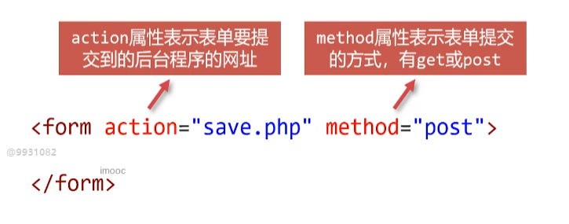
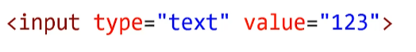
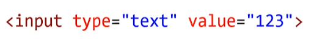
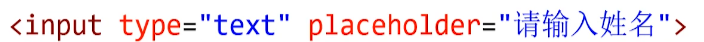
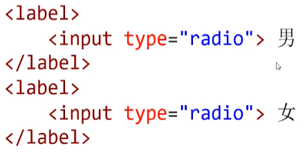
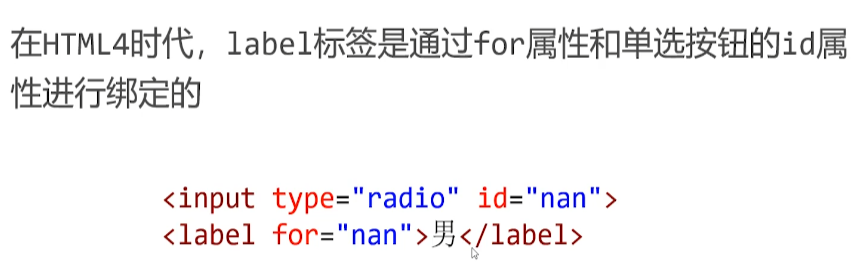
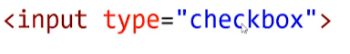
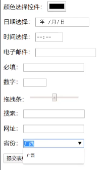

# 表单

表单用来**收集信息**，比如**注册、登录、发送评论反馈、购买商品**等等

表单是什么
所有HTML表单都以一个&lt;form>元素开始



输入form按tab自动添加action

mathod里面填大小写都可以

# 基本控件

### 单行文本框

使用type属性值被设置为text的< input>元素可以创建单行文本框，它是一个单标签



#### value属性

表示已经填写好的值



#### placeholder

表示**提示文本**，将以浅色文字写在文本框中，并不是文本框中的值



#### disabled属性

表示用户不能与元素交互，即"**锁死**”

```js
<form action="tijiao.php" method="POST">
        <p>
            请输入你的姓名：<input type="text">
        </p>
        <p>
            报考院校：<input type="text" value="清华大学" disabled>
        </p>
        <p>
            毕业学校：<input type="text" placeholder="请输入真实的毕业学校哦">
        </p>
  </form>
```

### 单选按钮

使用type属性值被设置为radio的&lt;input>元素可以创建单选按钮

单选按钮要有**value**属性值，向服务器提交的就是value值

单选按钮如果加上了**checked**属性，表示**默认被选中**

设置相同的name值互斥

```html
<form action="tijiao.php" method="POST">
 <p>
            性别：
            <label>
                <input type="radio" name="sex" value="男" checked> 男
            </label>
            
            <label>
                <input type="radio" name="sex" value="女"> 女
            </label>
        </p>
  </form>
```

#### 文字按钮绑定

labe1标签用来将文字和单选按钮进行绑定，用户单击文字的时候也视为点击了单选按钮



### 复选框

使用type属性值被设置为checkbox的< input>元素可以创
建复选框



同组复选框应该设置它们的name为相同值
复选框要有value属性值，向服务器提交的就是value值

```js
<p>
            爱好：
            <label>
                <input type="checkbox" name="hobby" value="足球"> 足球
            </label>
            <label>
                <input type="checkbox" name="hobby" value="蓝球"> 蓝球
            </label>
            <label>
                <input type="checkbox" name="hobby" value="羽毛球"> 羽毛球
            </label>
            <label>
                <input type="checkbox" name="hobby" value="游泳"> 游泳
            </label>
        </p>
```

### 密码框

使用type属性值被设置为password的< input>元素可以创建密码框

```html
<p>
           请输入密码：
            <input type="password">
 </p>
```

### 下拉菜单

< select>标签表示下拉菜单，< option>是它内部的选项

```html
 <p>
            请选择你最喜欢的编程语言：
            <select>
                <option value="JavaScript">JavaScript</option>
                <option value="Java">Java</option>
                <option value="PHP">PHP</option>
                <option value="C++">C++</option>
            </select>
    </p>
```

### 多行文本框

< textarea>< /textarea>表示多行文本框

```js
<p>
            留言：
            <textarea cols="100" rows="10"></textarea>
 </p>
```

### 三种按钮

表单中常见三种按钮，它们也都是input标签， type属性值
不同

| type属性值 | 按钮种类                                |
| ---------- | --------------------------------------- |
| button     | 普通按钮，可以简写为< button>< /button> |
| submit     | 提交按钮                                |
| reset      | 重置按钮                                |

```js
<p>
            <button>我是一个普通按钮</button>
        </p>
        <p>
            <input type="button" value="我是一个普通按钮">
        </p>
        <p>
            <input type="submit" value="提交表单">
        </p>
        <p>
            <input type="reset" value="重置表单">
        </p>
```

# HTML5中新增的表单控件

更丰富的input种类ie9

| type属性值 | 控件               |
| ---------- | ------------------ |
| color      | 颜色选择控件       |
| date、time | 日期、时间选择控件 |
| email      | 电子邮件输入控件   |
| file       | 文件选择控件       |
| number     | 数字输入控件       |
| range      | 拖拽条             |
| search     | 搜索框             |
| url        | 网址输入控件       |



必填属性：required

< datalist>控件

< datalist>控件可以为输入框提供一些备选项， 当用户输入的内容与备选项文字相同时，将会显示智能感应


```html
<form action="">
        <p>
            颜色选择控件：
            <input type="color">
        </p>
        <p>
            日期选择：
            <input type="date">
        </p>
        <p>
            时间选择：
            <input type="time">
        </p>
        <p>
            电子邮件：
            <input type="email">
        </p>
        <p>
            必填：
            <input type="text" required>
        </p>
        <p>
            数字：
            <input type="number" min="10" max="20">
        </p>
        <p>
            拖拽条：
            <input type="range" min="10" max="20">
        </p>
        <p>
            搜索：
            <input type="search">
        </p>
        <p>
            网址：
            <input type="url">
        </p>
        <p>
            省份：
            <input type="text" list="province-list">
            <datalist id="province-list">
                <option value="山西">
                <option value="山东">
                <option value="广西">
                <option value="广东">
                <option value="湖南">
                <option value="湖北">
                <option value="河南">
                <option value="河北">
            </datalist>
        </p>
        <p>
            <input type="submit" value="提交表单">
        </p>
    </form>
```

