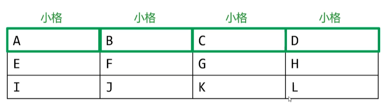
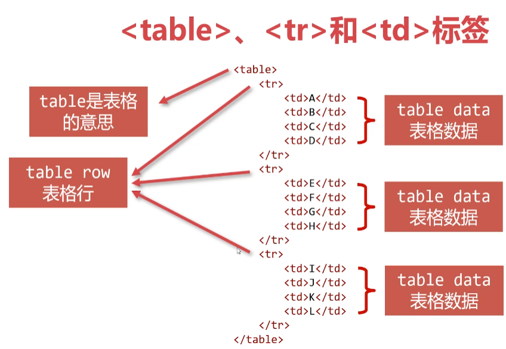
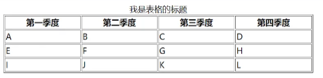
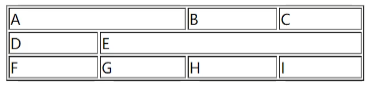
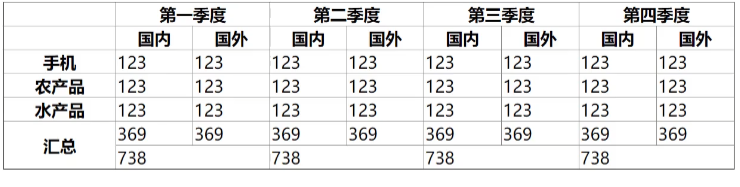

# 认识表格





### < table>的border属性

为了让表格能够**显示边框**，< table>标签通常有border属性

默认是双线表格

```js
//表格为1px宽
< table border="1" >
< /table>
```

### < table>的caption属性

< caption>是表格的标题，它常常作为< table> 的第一个
子元素出现



```html
<table border="1" width="600">
        <caption>我是表格的标题</caption>
        <tr>
            <th>第一季度</th>
            <th>第二季度</th>
            <th>第三季度</th>
            <th>第四季度</th>
        </tr>
        <tr>
            <td>A</td>
            <td>B</td>
            <td>C</td>
            <td>D</td>
        </tr>
        <tr>
            <td>E</td>
            <td>F</td>
            <td>G</td>
            <td>H</td>
        </tr>
        <tr>
            <td>I</td>
            <td>J</td>
            <td>K</td>
            <td>L</td>
        </tr>
    </table>
```

# 单元格合并

### colspan属性

colspan属性用来设置td或者th的**列跨度**



```html
<table width="400" border="1">
        <tr>
            <td colspan="2">A</td>
            <td>B</td>
            <td>C</td>
        </tr>
        <tr>
            <td>D</td>
            <td colspan="3">E</td>
        </tr>
        <tr>
            <td>F</td>
            <td>G</td>
            <td>H</td>
            <td>I</td>
        </tr>
    </table>
```

### rowspan属性

行跨度


```html
<table width="300" border="1">
        <tr>
            <td>A</td>
            <td>B</td>
            <td>C</td>
            <td>D</td>
        </tr>
        <tr>
            <td>E</td>
            <td rowspan="2">F</td>
            <td>G</td>
            <td rowspan="3">H</td>
        </tr>
        <tr>
            <td>I</td>
            <td>J</td>
        </tr>
        <tr>
            <td>K</td>
            <td>L</td>
            <td>M</td>
        </tr>
    </table>
```

< thead>标签定义**表头**
< tbody>标签定义表**核心内容**
< tfoot>标签定义表脚，通常是**汇总行**



```html
    <table border="1" width="700">
        <thead>
            <tr>
                <th></th>
                <th colspan="2">第一季度</th>
                <th colspan="2">第二季度</th>
                <th colspan="2">第三季度</th>
                <th colspan="2">第四季度</th>
            </tr>
            <tr>
                <th></th>
                <th>国内</th>
                <th>国外</th>
                <th>国内</th>
                <th>国外</th>
                <th>国内</th>
                <th>国外</th>
                <th>国内</th>
                <th>国外</th>
            </tr>
        </thead>
        <tbody>
            <tr>
                <th>手机</th>
                <td>123</td>
                <td>123</td>
                <td>123</td>
                <td>123</td>
                <td>123</td>
                <td>123</td>
                <td>123</td>
                <td>123</td>
            </tr>
            <tr>
                <th>农产品</th>
                <td>123</td>
                <td>123</td>
                <td>123</td>
                <td>123</td>
                <td>123</td>
                <td>123</td>
                <td>123</td>
                <td>123</td>
            </tr>
            <tr>
                <th>水产品</th>
                <td>123</td>
                <td>123</td>
                <td>123</td>
                <td>123</td>
                <td>123</td>
                <td>123</td>
                <td>123</td>
                <td>123</td>
            </tr>
        </tbody>
        <tfoot>
            <tr>
                <th rowspan="2">汇总</th>
                <td>369</td>
                <td>369</td>
                <td>369</td>
                <td>369</td>
                <td>369</td>
                <td>369</td>
                <td>369</td>
                <td>369</td>
            </tr>
            <tr>
                <td colspan="2">738</td>
                <td colspan="2">738</td>
                <td colspan="2">738</td>
                <td colspan="2">738</td>
            </tr>
        </tfoot>
    </table>
```

cellpadding属性定义了表格单元的**内容和边框之间的空间**
已经废弃，使用CSS替代它
cellspacing属性(使用百分比或像素)定义了**两个单元格**
**之间空间**的大小，已经废弃，使用CSS替代它