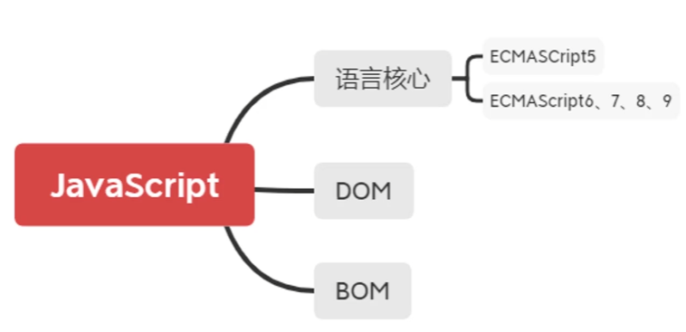

### js功能（行为层）

实现交互效果、数据收发、表单验证等

### 前后端

node.js可以在服务器中使用

### ECMAScript是JavaScript的标准

1997年，欧洲计算机制造商协会(ECMA)设置了JavaScript的标准，命名为ECMAScript

### js体系

### JavaScript的书写位置

1.在body中用script标签写

2.保存为js格式的文件

