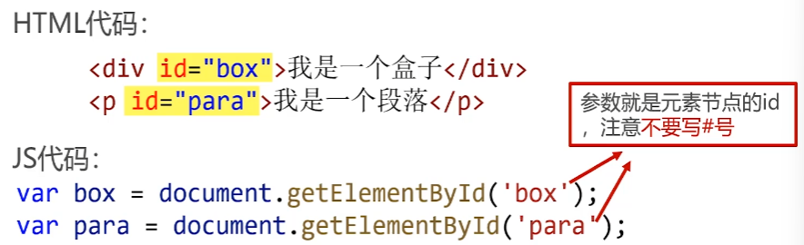
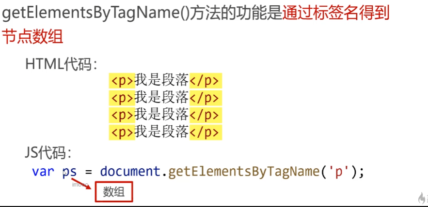
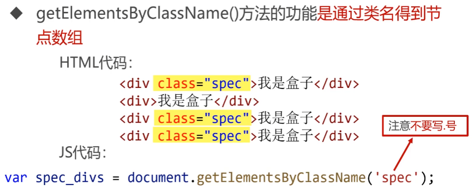

### js改变节点样式

backgroundColor驼峰命名法

节点.style.backgroundColor='red'

### 事件处理

默认为false

```css
元素.addEventListener('click', function() {
});
```

### id获取节点



### TagName标签名



### classname类名



