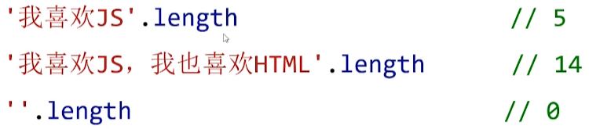

### js功能（行为层）

实现交互效果、数据收发、表单验证等

### 前后端

node.js可以在服务器中使用

### ECMAScript是JavaScript的标准

1997年，欧洲计算机制造商协会(ECMA)设置了JavaScript的标准，命名为ECMAScript


### js体系


### JavaScript的书写位置

1.在body中用script标签写

2.保存为js格式的文件，引入


## 弹出警告框

```js
<script>
        alert('你好');
</script>
```

### 函数的定义

功能的封装

alert是内置函数后面要写;

## 输出语句-console.log()

console是JS的内置对象，通过“打点”可以调用它内置的log“方法"
所谓“方法”就是对象能够调用的函数。

# 变量

变量是计算机语言中能储存**计算结果**或能表示**值**抽象概念

变量不是数值本身，它们仅仅是一个用于存储数值的**容器**

## 变量的命名规范(标识符的命名规则)

只能由字母、数字、下划线、$组成，但**不能以数字开头**

不能是**关键字**或**保留字**

变量名大小写敏感，a和A两个不同的变量

> 函数、类名、对象的属性等也都要遵守这个命名规则

### 变量的默认值

一个变量只定义，但没有赋初值，默认值是undefined
一个变量只有被var定义,并赋初值之后，才算正式初始化完成

### 同时声明多个变量

```js
var a = 0, b = 0;
```

## 变量声明提升

变量声明的提升:你可以**提前使用一个稍后才声明的变量**，而不会引发异常

在执行所有代码前，JS有**预解析**阶段,会预读所有变量的定义


# JavaScript中两大类数据类型

### 基本数据类型

Number、String、 Boolean、Undefined和Null

### 复杂数据类型

Object、Array、 Function、RegExp、Date、Map、Set等等

### typeof运算符

使用typeofi运算符可以**检测**值或者变量的**类型**


**repl环境**中检测

## 5种基本数据类型的typeof检测结果


undefined检测类型是undefined

null类型的检测结果是object

> #### 检测结果以**string类型**显示


# Number (数字)类型

小数中0可以省略


### $科学计数法


e相当于10的多少次方

### 不同进制的数字


### $一个特殊的数字型值NaN

NaN是英语"not a number"的意思，即"**不是一个数”，但它是一个数字类型的值**


0除以0的结果是NaN，事实上，在数学运算中，若**结果不能得到数**
**字**，其结果往往都是NaN

NaN有一个“奇怪”的性质**:不自等**。

# String(字符串)类型

字符串就是"**人类的自然语言**”-中文英文任何语言都可以


#### 字符串的拼接


#### 字符串的length属性



字母，标点，符号也占一个字符


# 布尔类型


# Undefined类型

一个没有被赋值的**变量的默认值**是undefined, 而undefined的类型也是undefined


# null类型

null表示"空”，它是“**空对象**”
当我们需要将对象销毁、数组销毁或者删除事件监听时，通常将它们设置为null。


使用typeof检测null值，结果是object


数组的检测类型也是object


