## 字符串常用的方法

也就是打点调用的函数

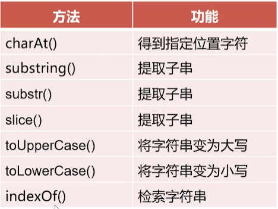

### charAt()选中下标的单个字符

char:字符，at在第几位

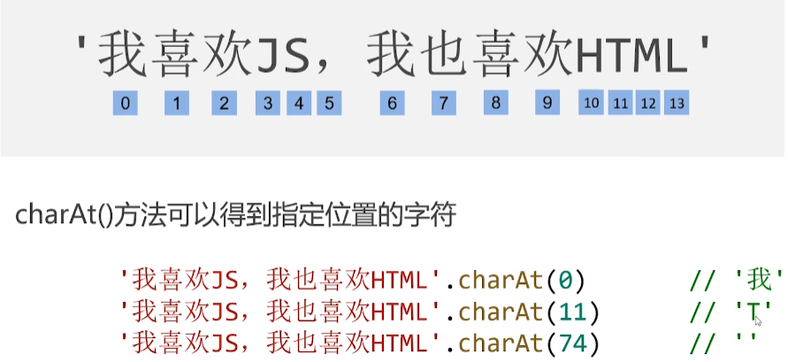

## substring()、substr()和slice()选取部分字符串

### substring()以下标选取一段字符

sub：子集，string：字符串，得到子字符串的意思

substring(a, b)方法得到从a开始到b结束(**不包括b处**)的子串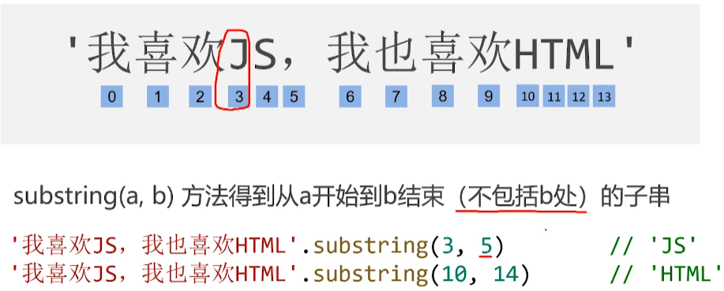

substring(a)方法如果**省略第二个参数**，返回的子串会一直到字符串的结尾

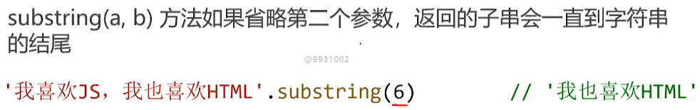

substring(a, b)中，**a可以大于b**,数字**顺序将自动调整**为小数在前

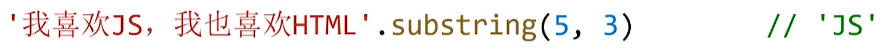

### substr()通过b长度决定选多少字符

substr (a, b)中，将得到从**a开始**的**长度为b**的子串

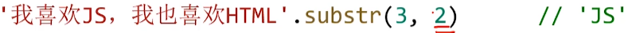

substr (a, b)中，**b可以省略**，表示到字符串**结尾**

substr (a, b)中，a可以是负数,表示倒数位置，b还是表示选几位

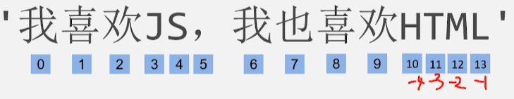

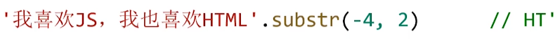

### slice()通过下标选择子串

slice：切片

和substring类似

slice(a, b)方法得到从a开始到b结束(不包括b处)的子串

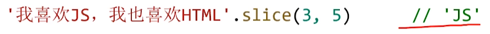

slice(a, b)的参数a可以是负数

选中倒数第a位到倒数第b位子串

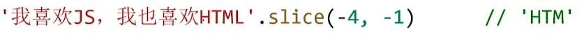

slice(a, b)中，参数a必须小于参数b

### 三种选择方法对比

substring (a, b)和slice(a, b)功能基本一致, 都是得到从a开始到b结束(不包括b)的子串，区别:
①substring()可以**自动交换两个参数位置**，而slice()不行;
②slice()的参数a可以是负数，而substring()不行。

substr(a, b)中参数b是**子串长度**,而不是位置编号

## toUpperCase()和toLowerCase()大小写转换

toUpperCase()转为大写

case：格，转换为占大格

toLowerCase()转为小写

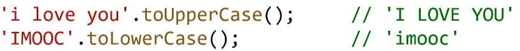

## indexOf()检索字符串中**首次出现**的位置

如果要检索的字符串值**没有**出现，则该返回-1

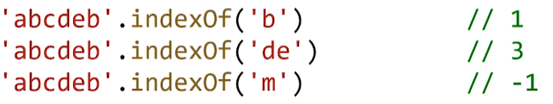