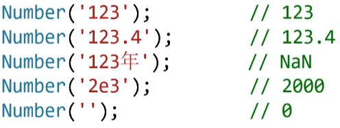

### 数据类型转换表


# 其他值→数字

### Number()函数

**纯数字**字符串能变为数字，**不是纯数字**的字符串将转为**NaN**

true变为1, false变为0

**undefined变为NaN**
**null变为0**




### parselnt()函数将字符串转为整数

以数字开头才能取整，非数字转换为NaN

**字符串和数字都可以取整**


```css
parseInt(3.99);//3
```

### parseFloat()字符串转为小数

0开头会去掉0

```js
parseFloat('3.14');// 3.14
parseFloat('3.14是圆周率'); // 3.14
parseFloat('圆周率是3.14');// NaN
parseFloat('3.99');// 3.99
```

# 其他值→字符串


### String()函数

变为“长得相同”的字符串。
科学计数法和非10进制数字会**转为10进制**的值。

```js
String(123);// '123'
String(123.4);//'123.4 '
String(2e3);// ' 2000'
String(NaN);// ' NaN'
String (Infinity);// ' Infinity'
String(0xf);//'15'

String(true);// 'true'
String(false);// 'false'

String( undefined) ;// ' undefined'
String(nu1l);// 'null'
```

### toString()方法**常用**：值转为字符串

几乎所有值都有toString()方法，功能是将值转为字符串

```js
6. toString() //报错
(6). toString() //'6'

var a=6;
a.toString()//6
```

# 其他值-→布尔值

### Boolean ()函数

**0和NaN转为false**,其他数字都转为true

```js
Boolean(123);// true
Boolean(0);// false
Boolean(NaN) ;// false
Boolean(Infinity);// true
Boolean( -Infinity); // true

```

空**字符串变为false**,其他都转为true

```js
Boolean('');// false
Boolean( ' abc');// true 
Boolean( 'false');//true
```

undefined和null转为false

```js
Boolean( undefined);//false
Boolean(null);//false
```

### prompt()函数弹出输入框

用户输入的内容是字符串类型


```js
// 让用户输入两个数字
        var a = Number(prompt('请输入第一个数字'));
        var b = Number(prompt('请输入第二个数字'));
```

