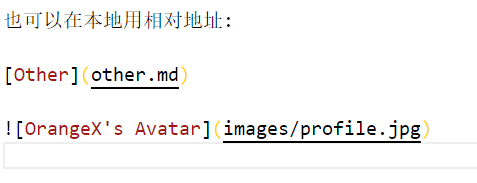
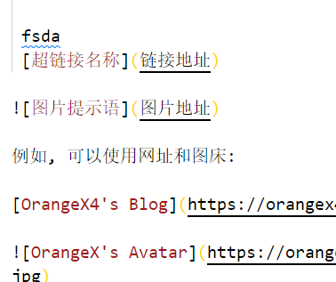

# Hello,word!
https://orangex4.cool/post/notes-in-markdown/#%E7%AC%AC%E4%B8%80%E4%B8%AA-markdown-%E6%96%87%E4%BB%B6-hello-world
在搜索框输入 Preview Theme, 看见标题为 Preview Theme 的选项, 在下拉框中选择 atom-dark.css, 就能让预览窗口的颜色改变了.
然后按照先后顺序按下快捷键 Ctrl + K, V, 然后在右边就会出现预览窗口.
# 一级标题

## 二级标题

### 三级标题

每写完一个段落要隔一行空行.

就像这样, 隔了一行空行.

---

分割线

**重点加粗**

*斜体*

~~删除线~~

---

列表:

* 无序列表
  * 嵌套无序列表
  * 嵌套无序列表
* 无序列表
* 无序列表

1. 有序列表 1
   1. 嵌套有序列表 1
   2. 嵌套有序列表 2
2. 有序列表 2
3. 有序列表 3

---

引用文本:

> 引用别人说的话
> 就这样写
> By. OrangeX4

---

这是 `行内代码` 语法.

代码块语法:

''' python
print("Hello, World!")
'''

请将 ' 替换成 `.

---

[超链接名称](链接地址)


---

表格:

| 表头 | 表头 |
| ---- | ---- |
| 内容 | 内容 |
| 内容 | 内容 |

---

注释:

<!-- 你看不见我 -->
# 一级标题
## 二级标题
### 三级标题
地方

段落之间要隔开一行

---

三条横线表示分割线，分割线上下各空一行
# 加粗
**加粗内容**
==高亮显示==

  Ctrl + B，给文本BBB
 - [x] 已经完成的事 1
 - [ ] 没完成的事情
* 无序列表
    * 无序列表项
      *无序列表项

1.有序列表
  1.有序列表

>用别人说的话

# 行内代码语法

```javascript {.line-numbers}
写代码
可以显示行数
```

 fsda 
 [超链接名称](链接地址)


例如, 可以使用网址和图床:

[OrangeX4's Blog](https://orangex4.cool/)


也可以在本地用相对地址:

[Other](other.md)


粘贴图片
按下快捷键 Ctrl + Alt + V



# 表格
| baiotou | biaotou |
| ---- | ---- |
| enirong | 内容 |
| ^    | |

你可以随手做点草稿, 如果还想保留着, 但是不显示, 就可以按下快捷键 Ctrl + \ 将当前行注释 / 反注释.

VSCode 快捷键
快捷键是用 VSCode 记笔记的精髓之一, 每一个都非常重要!

请务必认真记住这些快捷键!!!

原生快捷键
通用操作
Ctrl + C, 复制当前文本
Ctrl + V, 粘贴当前文本
Ctrl + Z, 撤销
Ctrl + Shift + Z, 反撤销
Shift + Alt + F, 整理代码
Ctrl + /, 将当前行注释 / 反注释, 当多行文本被选中时, 将多行文本注释
光标操作
Ctrl + ← 将光标向左移动一个单词
Ctrl + → 将光标向右移动一个单词
Ctrl + Alt + ↑, 向上加入一个光标
Ctrl + Alt + ↓, 向下加入一个光标
Ctrl + Alt + U, 撤销上次光标操作
界面移动
Ctrl + ↑ 向上移动当前界面
Ctrl + → 向下移动当前界面
选中操作
Shift + ← 向左选中 / 反选中一个字符 (重要)
Shift + → 向右选中 / 反选中一个字符 (重要)
Ctrl + Shift + ← 向左选中 / 反选中一个单词 (重要)
Ctrl + Shift + → 向右选中 / 反选中一个单词 (重要)
Ctrl + D 当前有选中文本时, 将下一个与其相同的文本加入选中 (重要)
文本行操作
Ctrl + C 当前无选中文本时, 复制当前行
Shift + Alt + ↑ 向上复制当前行, 当多行文本被选中时, 向上复制多行 (重要)
Shift + Alt + ↓ 向下复制当前行, 当多行文本被选中时, 向下复制多行 (重要)
Alt + ↑ 向上移动当前行, 当多行文本被选中时, 将当前多行文本向上移动 (重要)
Alt + ↓ 向下移动当前行, 当多行文本被选中时, 将当前多行文本向下移动 (重要)
插件增加的快捷键
Markdown 语法
Ctrl + B 当前有选中文本时, 将文本加粗
Ctrl + I 当前有选中文本时, 将文本变为斜体
Ctrl + M 进入数学公式模式 (加入美元符)
图片粘贴
Ctrl + Alt + V 粘贴剪贴板图片 (本地)
Ctrl + Alt + V 粘贴剪贴板图片 (图床)
光标操作
Ctrl + Alt + U 将多选光标变为单选
选中操作
Shift + Alt + ← 向左复制当前选中文本 (重要)
Shift + Alt + → 向右复制当前选中文本 (重要)
Alt + ← 向左移动当前选中文本一个字符 (重要)
Alt + → 向右移动当前选中文本一个字符 (重要)
Ctrl + Alt + ← 向左移动当前选中文本一个单词 (重要)
Ctrl + Alt + → 向右移动当前选中文本一个单词 (重要)
计算器功能
Ctrl + Shift + Alt + E 计算当前选中表达式, 用等号连接并输出
Ctrl + Shift + Alt + R 计算当前选中表达式, 并替换当前选中表达式
Ctrl + Shift + Alt + D 定义当前选中表达式, 无输出