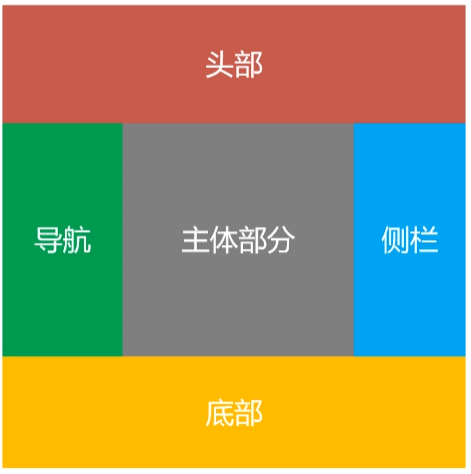

# grid网格布局

> 将网页划分成一个个网格，任意**组合网格**,做出各种各样的布局




### 兼容性

https://caniuse.com/?search=qrid

黄的代表要加前缀

红色不支持

绿色代表支持


### 基础

1.Grid 容器（container）和项目（item）

采用 Grid 网格布局的元素，称为 Grid 容器，设置grid容器的元素

display: grid | inline-grid;


Grid 容器的所有 *子元素* 自动成为容器成员，称为 Grid 项目


2.行、列和单元格

容器中的水平区域称为“行”（row），垂直区域称为“列”（column）

行和列的交叉区域，称为“单元格”（cell）


3.网格线

划分网格的线，称为“网格线”（grid line）

水平网格线划分出行，垂直网格线划分出列


4.其它

行间距、列间距（gap）

区域（area）

内容（content）所有的项目

网格轨道（track）


### Grid容器的属性

#### display属性：指定一个元素采用网格布局

display: grid ：块级元素/不设置宽度时撑开整个宽度

display:inline-grid;行内块/不设置宽度时内容撑开宽度


#### 2.grid-template-rows属性：行高

grid-template-columns属性：列宽

```css
grid-template-rows: 150px 150px 150px;
grid-template-columns: 150px 150px 150px;
```


#### 给网格线起名字

允许同一根网格线有多个名字

```css
grid-template-rows: [r1 r11] 150px [r2] 150px [r3] 150px [r4];
grid-template-columns: [c1] 150px [c2] 150px [c3] 150px [c4];
```

#### 百分比%:容器宽高的百分比(不包括内边距和边框)

因为设置了border-box

比如设置600px宽，设置33.33%的比例，一个占比是600-左右padding*33.33%

```css
grid-template-rows: 33.33% 33.33% 33.33%;
grid-template-columns: 33.33% 33.33% 33.33%;
```

#### fr

```css
height: 600px;
分三份
grid-template-columns: 1fr 1fr 1fr;
grid-template-rows: 1fr 1fr 1fr;

分4分占1,2，份
grid-template-columns: 1fr 2fr 1fr;
grid-template-rows: 1fr 2fr 1fr;

1fr占满剩余空间
grid-template-columns: 50px 1fr 50px;
grid-template-rows: 1fr 2fr 1fr;
```

#### auto:先于fr计算，获取必要的最小空间

和fr用法类似

auto先于fr计算

这里auto先获取自己的最小空间，也就是字体撑开的大小，之后1fr获取剩余空间

grid-template-columns: auto 1fr 150px;

grid-template-rows: 1fr 2fr 1fr;

#### repeat():简化重复的值

grid-template-rows: repeat(3, 150px);

grid-template-columns: repeat(3, 150px);

150px是重复值，也可以用1fr，25%，

##### auto-fill

​    当单元格的大小固定，希望容纳尽可能多的单元格，可以使用 auto-fill 自动填充，容器变大就单行单元格就多，容器不够就少放

```css
grid-template-columns: repeat(auto-fill, 150px);
grid-template-rows: repeat(3, 150px);
```

#### minmax(min, max):取值>=最小值，并且<=最大值

这个元素随着父盒子的宽度变化，范围在150~300px间，包括150和300

```css
grid-template-columns: 1fr minmax(150px, 300px) 1fr;
grid-template-rows: repeat(3, 150px);
```

### grid-auto-flow属性：定义项目的**排列顺序**

grid-auto-flow: row (默认值)| column| row
dense | column dense;

row (默认值)：先填满第一行，再放入第二行

column:先填满第一列， 再放入第二列（先竖着排，从左往右）

row dense, 横排列，在稍后出现较小的项目时，尝试填充网格中较早的空缺

column dense, 竖排在稍后出现较小的项目时，尝试填充网格中较早的空缺

### grid-auto-rows定义浏览器自动创建的**多余网格**的行高

grid-auto-columns定义浏览器自动创建的多余网格的列宽

grid-auto-rows: 200px;


### row-gap设置行间距(行与行之间的间距，不包括与外边框的间距)

column-gap设置列间距
gap是row-gap和column-gap的简写形式

```css
row-gap: 20px;
column-gap: 20px;
gap: 20px 20px;

/* 如果省略了第二个值，第二个值等于第一个值 */
gap: 20px;
```

### grid-template-areas属性定义区域

```css
grid-template-areas:
          'a b c'
          'd e f'
          'g h i';

/* 如果某些区域不需要利用，则使用“点”（.）表示 */
        grid-template-areas:
          'a . a'
          'd e f'
          'g g g';

/* 区域的命名会影响到网格线。每个区域的起始网格线，会自动命名为 区域名-start，终止网格线自动命名为 区域名-end */
grid-template-columns: [c1 c11] 150px [c2] 150px [c3] 150px [c4];
grid-template-rows: [r1] 150px [r2] 150px [r3] 150px [r4];
```

### align-items设置项目的垂直位置(上中下)


**justify-items**设置项目的水平位置(左中右)
**place-items**是align-items和justify-items的合并简写形式，

**stretch (默认值)** : 拉伸，占满**单元格**的整个宽高

start:对齐单元格的起始边缘

```css
align-items: stretch;
justify-items: stretch;
place-items: stretch stretch;

/* 如果省略第二个值，则浏览器认为与第一个值相等 */
place-items: stretch;

在单元格的左上角
align-items: start;
justify-items: start;
place-items: start start;

在单元格的右下角
align-items: end;
justify-items: end;
place-items: end end;

单元格的正中间
align-items: center;
justify-items: center;
place-items: center center;
```

### align-content设置整个内容区域的垂直位置(上中下)

justify-content设置整个内容区域的水平位置(左中右)
place-content是align-content和justify-content的合并简写形式


stretch (默认值) :项目大小没有指定时，拉伸占据整个网格容器

start :上左

end ：下右

center：居中

space-around：间隔是边缘间隔的两倍

space-between ：间隔一样，边缘紧贴

space-evenly;间隔都是一样的
place-content: align-content justify-content;

### grid-template是grid-template-columns、grid-template-rows和grid-template-areas这三个属性的合并简写形式

grid是grid-template-rows、 grid-template-columns、 grid-template-areas、 grid-auto-rows、 grid-auto-columns、grid-auto-flow这六个属性的合并简写形式

# Grid项目的属性


### 指定项目位置

grid-column-start

grid-column-end

grid-row-start

grid-row-end

#### number:数字，从第几个网格线开始，到第几个网格线结束


```css
grid-column-start: 1;
grid-column-end: 3;
grid-row-start: 1;
grid-row-end: 3;

负数
grid-column-start: -4;
grid-column-end: -2;

/* 项目可以相互重叠，使用 z-index 来控制重叠顺序，数字大的叠压数字小的 */
z-index: 1;

名字
/* name */
grid-column-start: c1;
grid-column-end: c3;
grid-row-start: r1;
grid-row-end: r3;

区域名字
grid-row-start: header-start;
grid-row-end: footer-start;
```

#### span number:该网格项将跨越网格数量

```css
grid-column-start: span 2;
```


grid-column是grid-column-start 和grid-column-end的合并简写形式
grid-row是grid-row-start和grid-row-end的合并简写形式

```css
grid-column: 1 / 3;
grid-row: 1 / 3;

省略后面的
/* 斜杠以及后面的部分可以省略，默认跨越一个网格 */
grid-column: 2;
grid-column: 2 / span 1;/*竖2开始，跨一个格子*/
```


### grid-area属性

和grid-template-areas联动

指定项目放在哪一个区域

```css
grid-area: header;
```


还可用作grid-row-start、 grid-column-start、 grid-row-end. grid-column-end的合并简写形式，直接指定项目的位置

```css
 /* 左上角(2,2)到右下角(3,3) */
grid-area: 2 / 2 / 3 / 3;
```

### align-self单个项目

align-self设置项目的垂直位置(上中下)，跟align-items的用法完全一致，但只作用于单个项目
justify-self设置项目的水平位置(左中右)，跟justify-items的用法完全一致，但只作用于单个项目
place-self是align-self和justify-self的合并简写形式


