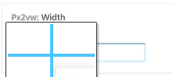

# 等比例缩放的布局

### 原理

常用尺寸iphone8-375x2,750px作为基准

1rem等于html的字体大小

当屏幕变化时修改html字体

html字体只是用来计算的，不用担心大小

### 1.原理

   750px / 96px


   宽高比不变

​	10px时

​    75rem / 9.6rem

   宽和高可以随着屏幕大小的变化而变化

​    当屏幕变化的时候修改 html 的字体大小


   375px / 48px

字体随屏幕大小变化，就能等比例缩放

   750/10=视口宽/html字体大小

  **html字体大小=视口宽/75**

### 实现

```js
{
    //获取dom元素
        const docEl = document.documentElement;

        const setHtmlFontSize = () => {
            //获取窗口宽度
          const viewWidth = docEl.clientWidth;

          docEl.style.fontSize = `${viewWidth / 75}px`;
        };

        setHtmlFontSize();
    //监听窗口大小改变时运行setHtmlFontSize函数
        window.addEventListener('resize', setHtmlFontSize, false);
      }
```

### 插件px2rem

user settings

搜索px2rem

#### 可以改rem大小

设置里面

搜索px2rem


### 3.扩展 flexible

   https://github.com/amfe/lib-flexible

   解决了 1px 边框问题


### em

当前元素的字体大小为1em，没有就以祖先元素为准

# VW +rem布局方案

### 原理

750px时html=10px

100vw时html=？

100vw/?vw=750px/10px

?=1.333333vw

### 实现

```css
html{
font-size：1.333333px
}
```

rem不用修改

# vw布局方案

### 原理

px/750px=?vw/100vw

?=px/7.5

### 插件

px2vw



优先使用vw方案

