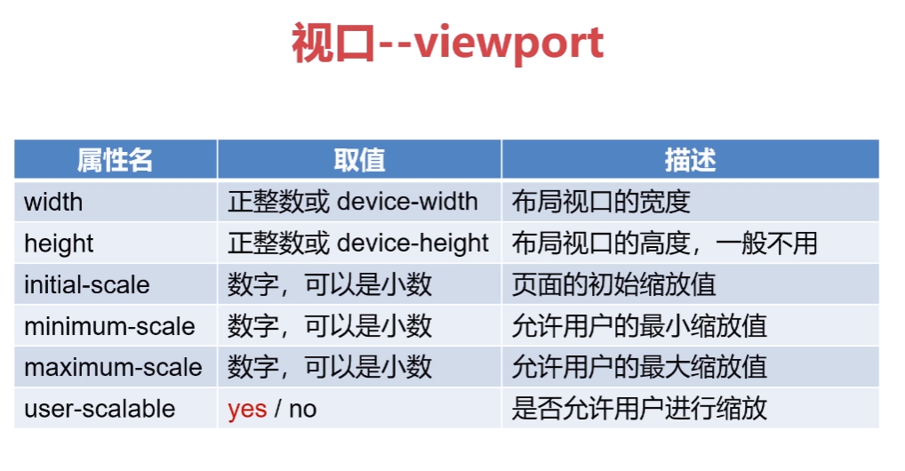

# 移动Web开发入门

### 什么是Web开发

HTML、CSS和JavaScript

代码在浏览器中运行

### 什么是移动Web和PCWeb开发

HTML、 CSS和JavaScript
代码在移动端(手机、平板等)浏览器中运行(移动Web开发)

代码在PC端浏览器中运行(PC Web开发)

### 移动Web与PC Web开发的关系

基本知识体系没有太大的区别
HTML、CSS 和JavaScript
不同的终端设备具有不同的特性
屏幕大小不同
网络环境和设备性能不同
交互方式不同

兼容性不同

### APP开发

Application应用程序
Native APP、**Web APP**和Hybrid APP (混合式APP)

# 基本概念

分辨率

物流像素

设备像素dp

### css像素（逻辑像素、设备独立像素（dip））

Css像素会自动换算成对应的物理像素

### 设备像素比

设备像素比(dpr: device pixel ratio)
dpr= (在一 个方向上)设备像素/ CSS像素(没有缩放时)

### 标清屏和高清屏

标清屏幕
dpr=1

高清屏幕（一个css上有多个物理像素）
dpr >1

### 缩放

缩放一放大

1CSS像素= 1个物理像素=>1CSS像素 = 2x2个物理像素

缩放一缩小

1CSS像素= 1个物理像素 =>2x2个CSS像素= 1个物理像素

### PPI

每英寸的物理像素点
ppi: pixels per inch
dpi: dots per inch

# 

# 视口--viewport

布局视口——移动设备自动缩放适应宽度，元素看起来很小

视觉视口——手机宽度

理想视口——理想的视觉大小排布，不需要手动调整大小

放在head标签中

```js
 <meta name="viewport" content="width=375" />
     //自动宽度等于设备宽度
    <meta name="viewport" content="width=device-width" />
        //初始缩放比例,数字大就放大
    <meta name="viewport" content="initial-scale=1" />

    <!-- 各有一些兼容性的问题，所以最好一起写 -->
    <meta name="viewport" content="width=device-width, initial-scale=1" />

    <!-- 很少使用，不用考虑 -->
    <meta name="viewport" content="height=375" />
```


是否允许缩放yes允许

user-scalable=yes

```js
<meta name="viewport" content="initial-scale=0.5, user-scalable=yes" />
    <meta name="viewport" content="initial-scale=0.5, user-scalable=no" />
```

最大最小缩放比例

maximum-scale=0.5, minimum-scale=0.5

```js
<meta
      name="viewport"
      content="initial-scale=0.5, maximum-scale=0.5, minimum-scale=0.5"
    />
```

常用代码

```js
 <!-- 如果不禁止缩放 -->
    <meta name="viewport" content="width=device-width, initial-scale=1" />

    <!-- 如果禁止缩放 -->
    <meta
      name="viewport"
      content="width=device-width, initial-scale=1, user-scalable=no, maximum-scale=1, minimum-scale=1"
    />
```

获取视口宽度

```js
方法一      
console.log(document.documentElement.clientWidth);
方法二
console.log(document.documentElement.getBoundingClientRect().width);

```



# 真机查看

通过本地服务器打开开发页面
通过ipconfig查询IP地址，并替换页面地址中的相应部分

cmd=>ipconfig=>ipv4,替换前面的127.0.1

关闭电脑防火墙，在移动设备的浏览器中输入相应网址

# 开发中的常用单位

###  px

   绝对单位

   当需要设置固定宽高时可用，也可用于设置字体大小


###  % 

可以用来布局

   相对单位

   可以用来设置宽度，流体布局中会用到


### em

   相对单位

   设置字体大小时，1em=**父元素**字体的大小

   设置其他，比如宽、高时，1em=**自身字体**的大小

   一般用来控制行首的缩进，一般不用来布局2em


### rem(root element html)  

​	可以用来布局

   相对单位

   1rem=**根元素（html）**的字体大小


### vw/vh/vmax/vmin  

可以用来布局

   相对单位，视口单位

   1vw=视口宽度的 1%，**css像素称为视口宽度**

   1vh=视口高度的 1%

   vmin：当前 vw 和 vh 中较小的一个值

   vmax：当前 vw 和 vh 中较大的一个值
