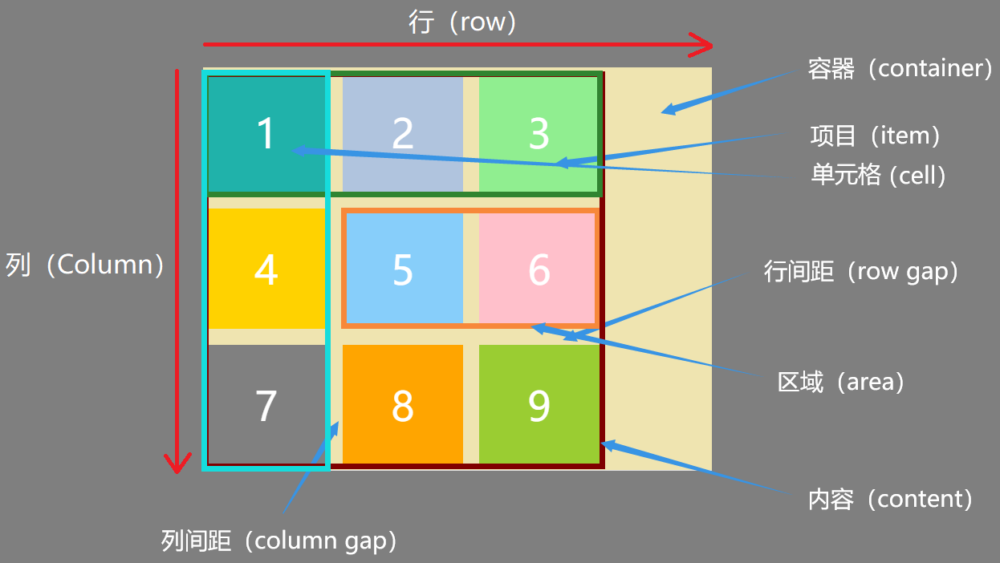
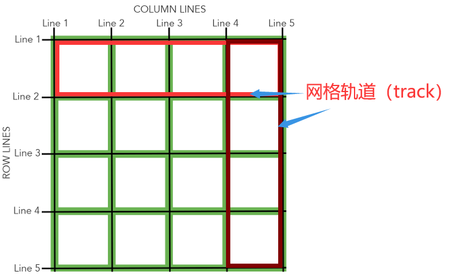
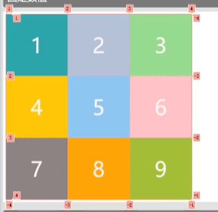

# grid网格布局

> 将网页划分成一个个网格，任意**组合网格**,做出各种各样的布局


### 兼容性

https://caniuse.com/?search=qrid

黄的代表要加前缀

红色不支持

绿色代表支持


### 基础

1.Grid 容器（container）和项目（item）

采用 Grid 网格布局的元素，称为 Grid 容器，设置grid容器的元素

display: grid | inline-grid;


Grid 容器的所有 *子元素* 自动成为容器成员，称为 Grid 项目





2.行、列和单元格

容器中的水平区域称为“行”（row），垂直区域称为“列”（column）

行和列的交叉区域，称为“单元格”（cell）


3.网格线

划分网格的线，称为“网格线”（grid line）

水平网格线划分出行，垂直网格线划分出列


4.其它

行间距、列间距（gap）

区域（area）

内容（content）所有的项目

网格轨道（track）



### Grid容器的属性

#### display属性：指定一个元素采用网格布局

display: grid ：块级元素/不设置宽度时撑开整个宽度

display:inline-grid;行内块/不设置宽度时内容撑开宽度


#### 2.grid-template-rows属性：行高

grid-template-columns属性：列宽

```css
grid-template-rows: 150px 150px 150px;
grid-template-columns: 150px 150px 150px;
```




#### 给网格线起名字

允许同一根网格线有多个名字

```css
grid-template-rows: [r1 r11] 150px [r2] 150px [r3] 150px [r4];
grid-template-columns: [c1] 150px [c2] 150px [c3] 150px [c4];
```

#### 百分比%:容器宽高的百分比(不包括内边距和边框)

因为设置了border-box

比如设置600px宽，设置33.33%的比例一个占比是600-左右padding

```css
grid-template-rows: 33.33% 33.33% 33.33%;
grid-template-columns: 33.33% 33.33% 33.33%;
```

#### fr

```css
height: 600px;
分三份
grid-template-columns: 1fr 1fr 1fr;
grid-template-rows: 1fr 1fr 1fr;

分4分占1,2，份
grid-template-columns: 1fr 2fr 1fr;
grid-template-rows: 1fr 2fr 1fr;

1fr占满剩余空间
grid-template-columns: 50px 1fr 50px;
grid-template-rows: 1fr 2fr 1fr;
```

#### auto:先于fr计算，获取必要的最小空间

和fr用法类似

auto先于fr计算

这里auto先获取自己的最小空间，也就是字体撑开的大小，之后1fr获取剩余空间

grid-template-columns: auto 1fr 150px;

grid-template-rows: 1fr 2fr 1fr;

#### repeat():简化重复的值

grid-template-rows: repeat(3, 150px);

grid-template-columns: repeat(3, 150px);

150px是重复值，也可以用1fr，25%，

##### auto-fill

​    当单元格的大小固定，容器大小不确定时，如果希望每一行（或每一列）容纳尽可能多的单元格，可以使用 auto-fill 自动填充，容器变大就多放，容器不够就少放

```css
grid-template-columns: repeat(auto-fill, 150px);
grid-template-rows: repeat(3, 150px);
```

#### minmax(min, max):取值>=最小值，并且<=最大值

这个元素随着父盒子的宽度变化，范围在150~300px间，包括150和300

```css
grid-template-columns: 1fr minmax(150px, 300px) 1fr;
grid-template-rows: repeat(3, 150px);
```

### grid-auto-flow属性：定义项目的排列顺序

grid-auto-flow: row (默认值)| column| row
dense | column dense;

row (默认值)：先填满第一行，再放入第二行
