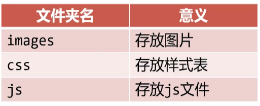
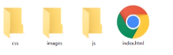
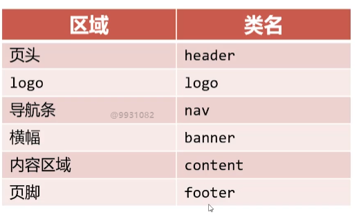

### 项目起步

创建文件夹结构，主要文件夹如下



### 网站首页index.html

绝大多数服务器默认的网站首页名为index.html



标题，关键词，页面描述

## div的常见类名

< div>标签可以添加class属性表示"类名”，类名服务于CSS



### 第一步代码

```html
<!DOCTYPE html>
<html lang="en">

<head>
    <meta charset="UTF-8">
    <meta name="viewport" content="width=device-width, initial-scale=1.0">
    <title>小慕医生 - 责任、品质、关爱</title>
    <meta name="Description" content="小慕医生是专业的医院，理念就是责任、品质、关爱">
    <meta name="Keywords" content="美容，减脂，内科，外科">
</head>

<body>
    <!-- 页面头部 -->
    <div class="header">
        <!-- 网页的logo -->
        <div class="logo">
            <h1>小慕医生</h1>
        </div>

        <!-- 网页的功能区 -->
        <div class="tool"></div>
        <!-- 网页的导航条 -->
        <div class="nav"></div>
    </div>


    <!-- 网页的banner -->
    <div class="banner"></div>

    <!-- 网页的主要 内容 -->
    <div class="content">
        <!-- 常用链接 -->
        <div class="useful-links"> </div>
        <!-- 医院动态和医院公告区域 -->
        <div class="news-and-notice">
            <!-- 医院动态 -->
            <div class="news">
                <h3>医院动态</h3>
            </div>
            <!-- 医院公告 -->
            <div class="notice">
                <h3>医院公告</h3>
            </div>
        </div>

        <!-- 广告图片 -->
        <div class="ad-images"></div>

        <!-- 科室介绍 -->
        <div class="dep-info">
            <h2>科室介绍</h2>
        </div>

        <!-- 专家介绍 -->
        <div class="exp-info">
            <h2>专家介绍</h2>
        </div>
    </div>

    <!-- 页脚 -->
    <div class="center">
        <!-- 友情链接 -->
        <div class="friend-links"></div>

        <!-- 小慕医生联系方式 -->
        <div class="address"></div>
    </div>
</body>

</html>
```


